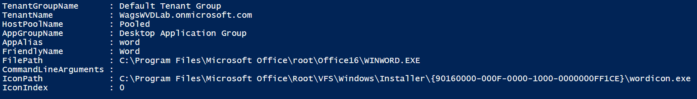

# Lab 9: Deploying an Application Pool for Remote App

The default app group created for a new Windows Virtual Desktop host pool also publishes the full desktop. In addition, you can create one or more RemoteApp application groups for the host pool. Follow this tutorial to create a RemoteApp app group and publish individual Start menu apps.

## Exercise 1 - Create a RemoteApp group

1. Run the following PowerShell cmdlet to create a new empty RemoteApp app group.

   ```powershell
   #Set the $hostpoolname and $TenantName variables
   $hostpoolname = "Pooled"
   $TenantName = "The name of your tenant"

   # execute the command
   New-RdsAppGroup -TenantName $TenantName -HostPoolName $hostpoolname -Name RemoteApp
   ```

2. (Optional) To verify that the app group was created, you can run the following cmdlet to see a list of all app groups for the host pool.

   ```powershell
   Get-RdsAppGroup $TenantName $hostpoolname
   ```

3. Run the following cmdlet to get a list of **Start** menu apps on the host pool's virtual machine image.
   * Search for and find **Word**.
   * Write down the values for **FilePath**, **IconPath**, **IconIndex**, and other important information for the application that you want to publish.

   ```powershell
   Get-RdsStartMenuApp $TenantName $hostpoolname <appgroupname>
   ```

   
4. Run the following cmdlet to install the application based on `AppAlias`. `AppAlias` becomes visible when you run the output from step 3.

   ```powershell
   # Set the required variables
   $remoteappname = "Word"
   $appalias = "word"
   $appgroupname = "Desktop Application Group"
   $filepath = "C:\Program Files\Microsoft Office\root\Office16\WINWORD.EXE"
   $iconpath = "C:\Program Files\Microsoft Office\Root\VFS\Windows\Installer\{90160000-000F-0000-1000-0000000FF1CE}\wordicon.exe"
   $iconindex = "0"

   # execute the command
   New-RdsRemoteApp  $TenantName $hostpoolname $appgroupname -Name $remoteappname -Filepath $filepath -IconPath $iconpath -IconIndex $iconindex
   ```

5. (Optional) Run the following cmdlet to publish a new RemoteApp program to the application group created in step 1.

   ```powershell
   New-RdsRemoteApp <tenantname> $TenantName <appgroupname> -Name <remoteappname> -Filepath <filepath>  -IconPath <iconpath> -IconIndex <iconindex>
   ```

6. To verify that the app was published, run the following cmdlet.

   ```powershell
   Get-RdsRemoteApp $TenantName <hostpoolname> <appgroupname>
   ```

7. Repeat steps 1–5 for each application that you want to publish for this app group.
8. Run the following cmdlet to grant users access to the RemoteApp programs in the app group.

   ```powershell
   Add-RdsAppGroupUser <tenantname> <hostpoolname> <appgroupname> -UserPrincipalName <userupn>
   ```

### Return to [Deploy Phase Labs](deploy.md)
