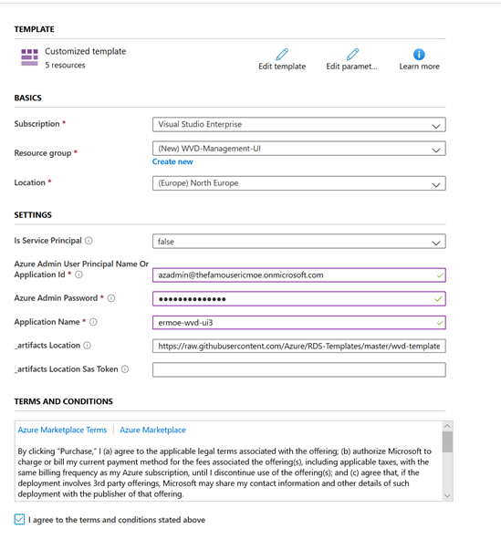
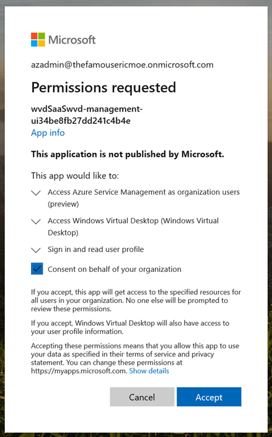
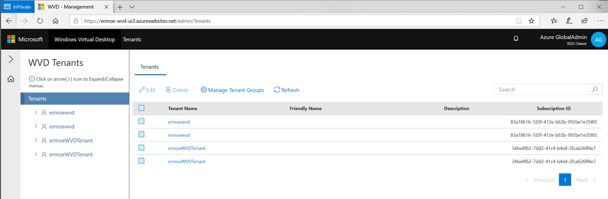
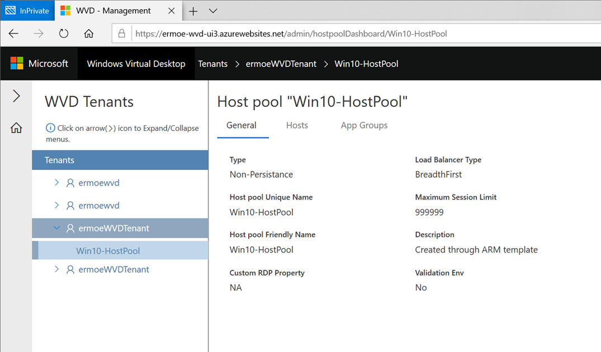
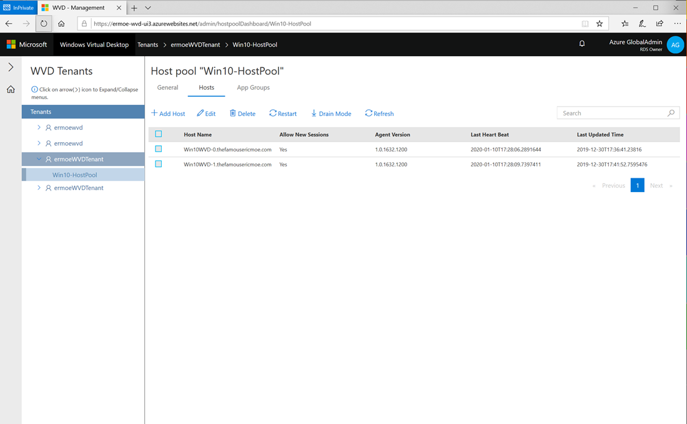

# Lab 11: Install the Management UI

The following lab walks through the deployment of a basic Management UI that has been available via Github.

This management tool is a sample. Microsoft will provide important security and quality updates. The source code is available in GitHub at [https://github.com/Azure/RDS-Templates/tree/master/wvd-templates/wvd-management-ux/deploy](). 

Customers and partners are encouraged to customize the tool to fit their business needs.

Before deploying the management tool, you will need an Azure Active Directory (Azure AD) user who can both create an app registration and have rights to deploy deploy the management UI. This user must:

- [X] Have Azure Multi-Factor Authentication (MFA) disabled
- [X] Have permission to create resources in your Azure subscription
- [X] Have permission to create an Azure AD application. 

##Deploy UI

Log in with your **AZADMIN** account to get to your subscription associated with your Azure AD Tenant. 

Navigate to https://github.com/Azure/RDS-Templates/tree/master/wvd-templates/wvd-management-ux/deploy

Select **Deploy to Azure**

Select your existing Resource Group or create a new one. Creating a new one is a good way to keep the resources specific to this UI together so it's easier to delete if you choose not to continue using the UI.

Leave _Is Service Principal_ to **false**

For the Azure Admin account /password, use the **azadmin** account you have been using in this environment

For the Application name, _select a unique name_. This name will be used in the URL so don’t go too crazy!

Agree to the T’s and C’s and click “**Purchase**”

After a few minutes, the deployment completes.

##Confirm App Permissions

Before you launch the UI, let's check confirm some permissions in Azure AD.

Navigate to **Azure Active Directory**.

Select **Users** and then select **User Settings**

Select the link "**Manage how end users launch and view their applications**"

Verify _users can consent to apps accessing company data on their behalf_ is set to **Yes**

If the setting is set to "No", change it to "Yes" and save changes.

##Access Management UI

Navigate back into the Resource Group that contains the Management UI resources.

Look for the App Service that matches the name of the UI you chose and select it.

Once you are in the App Service, locate the **URL** associated with it and copy the URL to clipboard.

Open a browser and paste in the URL. Authenticate with your AZADMIN account.

When prompted, **grant consent** for the application as shown below:

You will be prompted to select your tenant group. It should be set to **Default Tenant Group**. 

Click **Save**

Locate your WVD tenant. In the screenshot below there are several tenants due to my test environment being provisioned, de-provisioned and newly provisioned several times.

After **expanding** _your WVD tenant_ you should see your host pool(s).

After you **click** on your _host pool_ you will see your session hosts listed.

Select the **App Groups** tab to see any App Groups that may be configured in your host pool.

This was an example UI deployed from Github and is meant to show "the art of the possible" for pushing a custom management UI that does not require the administrator to navigate through the Azure portal, resource groups, VMs and so on. Clearly there is ample opportunity to expand and enhance this - that exercise is left to the reader.
