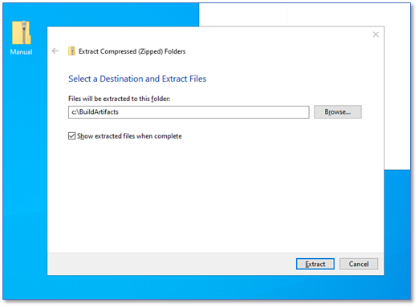
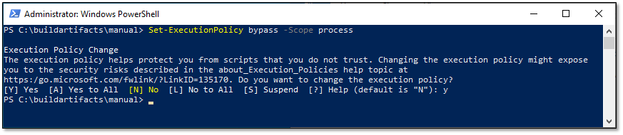
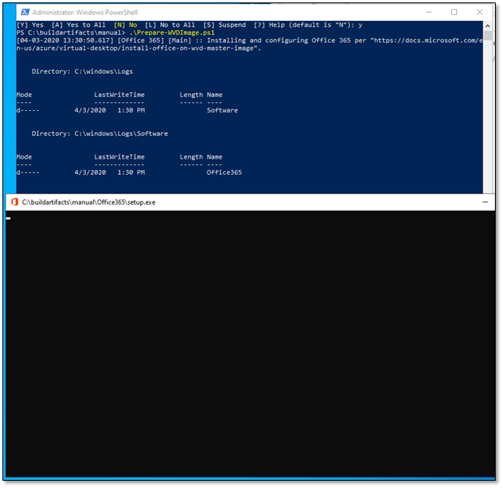
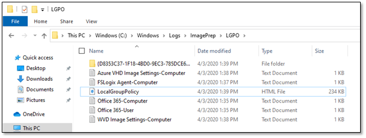
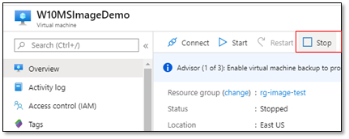
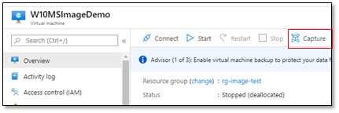
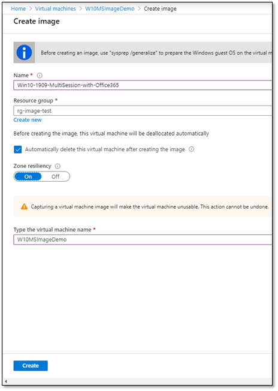

# Create a Custom WVD Master Image

> This lab involves building and updating base or golden images and may take several hours to complete.  Please plan accordingly.

## Exercise 1 - Create a new Virtual Machine (VM) in Azure

1. In your Azure Portal, click on **+ Create a resource**, and in the search field type **Microsoft Windows 10**.
2. Select **Windows 10 Enterprise multi-session, Version 1909** and click **Create**.

   

3. Complete the following on the **Basics** tab:
   * Resource Group: *Create New* **WVDLab-GoldenImage**
   * Virtual machine name: **GoldenImage**
   * Size: **Standard D2 v3**
   * Username: `<yourfirstname>`
   * Password: `Complex.Password`
   * Confirm password: `Complex.Password`
4. Complete the following on the **Networking** tab:
   * Virtual Network: Select **AD-VNet**
   * Subnet: Select **AD-Subnet**
5. Click **Review + create**.  Once validation passes, click **Create**.

## Exercise 2 - Run Windows Update

1. Click on **Go to resource** once the deployment is complete.
2. RDP into your **GoldenImage** VM and run Windows update.
3. Download and apply any updates, reboot as needed.

## Exercise 3 - Install Office on a master VHD image

In this exercise you will learn how to install Office 365 ProPlus, OneDrive, and other common applications on a master virtual hard disk (VHD) image for upload to Azure.

1. RDP into your **GoldenImage** virtual machine and download the [Office Deployment Tool](https://www.microsoft.com/en-us/download/details.aspx?id=49117).
2. Using Notepad create and save **configuration.xml** on your desktop:

   ```PowerShell
   <Configuration>
      <Add OfficeClientEdition="64" Channel="Monthly">
         <Product ID="O365ProPlusRetail">
            <Language ID="en-US" />
            <Language ID="MatchOS" />
            <ExcludeApp ID="Groove" />
            <ExcludeApp ID="Lync" />
            <ExcludeApp ID="OneDrive" />
            <ExcludeApp ID="Teams" />
         </Product>
      </Add>
      <RemoveMSI/>
      <Updates Enabled="FALSE"/>
      <Display Level="Full" AcceptEULA="TRUE" />
      <Logging Level=" Standard" Path="%temp%\WVDOfficeInstall" />
      <Property Name="FORCEAPPSHUTDOWN" Value="TRUE"/>
   <Property Name="SharedComputerLicensing" Value="1"/>
   </Configuration>
   ```

   * This sample configuration XML will do the following things:
      * Install Office from the monthly channel and deliver updates from the monthly channel when they're executed.
      * Use the x64 architecture.
      * Disable automatic updates.
      * Remove any existing installations of Office and migrate their settings.
      * Enable shared computer activation.
3. Open File Explorer, change the the **Downloads** directory, and run `officedeploymenttool_12624-20320`.  Complete a default installation.
4. Open a command prompt, switch to `c:\users\jeff` and enter the following command:

   `Setup.exe /configure C:\Users\<yourfirstname>\Downloads\configuration.xml`

   > Installation can take 10-15 minutes to complete.

5. Click on the Start menu and you should see Office applications listed.

## Exercise 4 - Download and Install FSLogix

1. Return to Microsoft Edge and navigate to [Download and Install FSLogix](https://aka.ms/fslogix_download). Save the file to `c:\users\<yourfirstname>\downloads`

2. Switch to File Explorer, then navigate to `c:\users\<yourfirstname>\downloads`.  Double-click on the compressed file,  then **Compressed Folder Tools**, then **Extract All**, then **Extract**.


3. Navigate to the extraction folder, then **x64** directory, then **Release** folder, and run **FSLogixAppsSetup** to install the FSLogix agent.  Complete a default installation.

4. Navigate to **Program Files** \> **FSLogix** \> **Apps** to confirm the agent installed.

5. Open a Command Prompt and run **RegEdit32** as an administrator. Navigate to **Computer\\HKEY_LOCAL_MACHINE\\software\\FSLogix\\**.

6. Open PowerShell and execute the following commands:

    ``` powershell
    #Create the key
    New-Item -Path HKLM:\Software\FSLogix\ -Name Profiles –Force

    #Create Enabled
    Set-ItemProperty -Path HKLM:\Software\FSLogix\Profiles -Name "Enabled" -Type "Dword" -Value "1"

    #Create the VHDLocations
    New-ItemProperty -Path HKLM:\Software\FSLogix\Profiles -Name "VHDLocations" -Value \\DC01\WVDFSLogix -PropertyType MultiString -Force

    #Create the SizeInMBs
    Set-ItemProperty -Path HKLM:\Software\FSLogix\Profiles -Name "SizeInMBs" -Type "Dword" -Value "32768"

    #Create IsDynamic
    Set-ItemProperty -Path HKLM:\Software\FSLogix\Profiles -Name "IsDynamic" -Type "Dword" -Value "1"

    #Create LockedRetryCount
    Set-ItemProperty -Path HKLM:\Software\FSLogix\Profiles -Name "LockedRetryCount" -Type "Dword" -Value "1"

    #Create LockedRetryInterval
    Set-ItemProperty -Path HKLM:\Software\FSLogix\Profiles -Name "LockedRetryInterval" -Type "Dword" -Value "0"
    ```

7. Return to Registry Editor, then select **View** then **Refresh** and confirm your settings:

    

8. **Restart** the virtual machine.

xxxxxxxxxxxxxxxxxxxxxxxxxxxxxxxxxxxxxxxxxxxxxxxxxxxxxxx


2. Installs the *latest* OneDrive *per-machine* and apply settings as specified by [https://docs.microsoft.com/en-us/azure/virtual-desktop/install-office-on-wvd-master-image
](https://docs.microsoft.com/en-us/azure/virtual-desktop/install-office-on-wvd-master-image).

3. Installs Microsoft Teams *per-machine* as specified by [https://docs.microsoft.com/en-us/azure/virtual-desktop/teams-on-wvd](https://docs.microsoft.com/en-us/azure/virtual-desktop/teams-on-wvd).

4. Installs the *latest* production FSLogix Agent and apply settings as specified by [https://docs.microsoft.com/en-us/fslogix/install-ht](https://docs.microsoft.com/en-us/fslogix/install-ht).

5. Installs Microsoft Edge Enterprise and apply settings as discussed in [https://docs.microsoft.com/en-us/deployedge/deploy-edge-with-configuration-manager](https://docs.microsoft.com/en-us/deployedge/deploy-edge-with-configuration-manager).

6. Applies the WVD Image Settings as specified in [https://docs.microsoft.com/en-us/azure/virtual-desktop/set-up-customize-master-image](https://docs.microsoft.com/en-us/azure/virtual-desktop/set-up-customize-master-image).

7. Applies the Azure VM Settings as specified in [https://docs.microsoft.com/en-us/azure/virtual-machines/windows/prepare-for-upload-vhd-image](https://docs.microsoft.com/en-us/azure/virtual-machines/windows/prepare-for-upload-vhd-image).

8. Performs an automated Disk Cleanup using the built-in Windows Disk Cleanup Wizard utility (cleanmgr.exe). ![Note] If you do not disable this action, you will want to reboot after running the script.

The benefits of using the script are that you automatically get an *optimized* install of the listed software and base Windows 10 configuration for Windows Virtual Desktop. The script is documented within starting with the purpose of the parameters and generates a log in "c:\windows\logs\imageprep" for troubleshooting. Where possible, the script applies the settings and configuration to the Local Group Policy on the system via the lgpo tool from the Microsoft Security Compliance Toolkit [https://www.microsoft.com/en-us/download/details.aspx?id=55319](https://www.microsoft.com/en-us/download/details.aspx?id=55319). In addition, the local group policy is documented in an html file and a backup both located in "C:\windows\logs\imageprep\lgpo". This approach is taken to simplify troubleshooting via Group Policy Results versus having to search for registry settings directly.

The script and tools are maintained in the WVD Lab Sources Repo under the WVDImaging\\Manual folder located [here](https://servicescode.visualstudio.com/WVD%20Bootcamp%20Labs/_git/WVDSources?path=%2FWVDImaging%2FManual). The contents of the Manual folder should be downloaded as a .zip file directly using this [link](https://servicescode.visualstudio.com/45c551a2-105f-4bdb-b096-134ebc8001c5/_apis/git/repositories/ec513ac5-8907-4014-bcb7-a84229a2d7be/items?path=%2FWVDImaging%2FManual&versionDescriptor%5BversionOptions%5D=0&versionDescriptor%5BversionType%5D=0&versionDescriptor%5Bversion%5D=master&resolveLfs=true&%24format=zip&api-version=5.0&download=true).

1. Download the zip file to your workstation and copy and paste the zip through RDP to the desktop of the master image VM. If you are prompted to login by this download, use your @microsoft.com account.

2. On the master image VM, right click on the zip file on your desktop and select **Extract All...**.

3. Extract the files to "c:\BuildArtifacts".

   

4. Open 'c:\buildartifacts\manual\Prepare-WVDImage.ps1' in the Powershell Integrated Scripting Environment (Powershell ISE) and update the parameters as necessary based on the documentation within the script. Once you are happy, with the script configuration, save it.

   

5. Open Powershell administratively.

6. Navigate to "C:\BuildArtifacts\Manual".

7. Run **Set-ExecutionPolicy -ExecutionPolicy Bypass -Scope Process** and select **[Y] Yes**.

   

8. Execute the script by typing **.\prepare-wvdimage.ps1** and hitting <Enter>. This script will produce output to the console and the log located in "c:\windows\logs\imageprep". It may take some time to run especially if you selected to install Office 365 as it will download those files dynamically from the Microsoft Content Distribution Network (CDN).

   If you selected to install office, you will see a setup.exe popup for sometime. Do not close this.

   

   If you selected to install OneDrive, you will see the onedrive popup.

   

   If you selected to cleanupimage, you will see the Disk Cleanup wizard running and it may stay on the "Windows Update Cleanup" task for a few minutes while it cleans out older files in the Windows Side by Side store.

   

   You may notice after the Disk Cleanup Wizard disappears from the screen that it appears that the powershell window is frozen. It does take a few minutes for the cleanmgr.exe process to close. You can select the powershell window and continue to hit the up arrow on your keyboard until you are presented with an active prompt. At this point, you can delete the c:\buildartifacts directory and the files on the desktop. Empty the recycle bin afterwards.

   If you are interested in the LGPO backup and settings, navigate to C:\Windows\Logs\ImagePrep\LGPO.

   

9. Reboot the master image VM.

#### Task 4: Run Sysprep

1. Reconnnect and logon to the VM. 

2. Open an administrative command prompt.

2. Navigate to **c:\windows\system32\sysprep**.

3. Run **sysprep.exe /oobe /generalize /shutdown**.

   

   The system will automatically shutdown and disconnect your RDP session.

#### Task 5: Create a managed image from the Master Image VM

1. Go into the Azure Portal and find the VM that you ran sysprep on, The **Status** should be listed as "Stopped". Select **Stop** to move it to a stopped state (deallocated)

   

2. Once this is done, on the top of the same screen, click capture.

   

3. Once you click capture, fill in all the associated fields.

   

   Once completed you should now see the image,

   

4. Record the image name and resource group in order to use it as a custom image in the next task.

#### Task 6: Provision a Host Pool with the custom image 

To start provisioning a host pool with the custom image, follow the instructions in [Exercise 6](Exercise-6%3A-Deploy-a-Pooled-Host-Pool.md) except for the Virtual Machine Settings screen. Instead of selecting a 'Gallery' Image, you will select a 'Managed Image' as in the screenshot below.


Complete the remainder of the instructions in [Exercise 6](Exercise-6%3A-Deploy-a-Pooled-Host-Pool.md) to provision a new host pool with the managed image.
