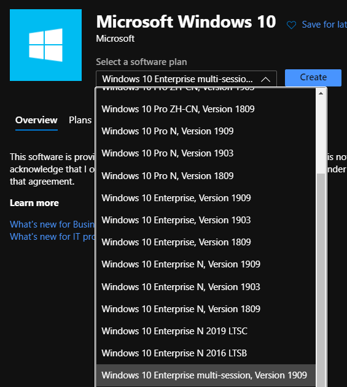
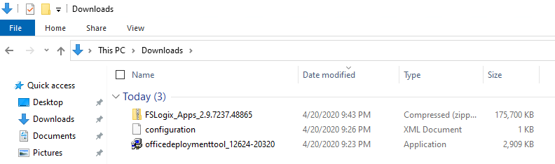
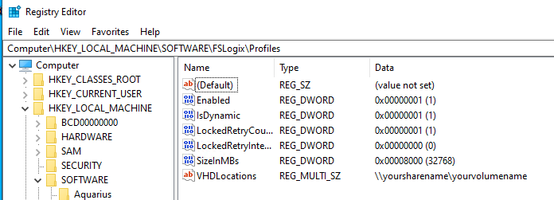

# Create a Custom WVD Master Image

> This lab involves building and updating base or golden images and may take several hours to complete.  Please plan accordingly.

## Exercise 1 - Create a new Virtual Machine (VM) in Azure

1. In your Azure Portal, click on **+ Create a resource**, and in the search field type **Microsoft Windows 10**.
2. Select **Windows 10 Enterprise multi-session, Version 1909** and click **Create**.

   

3. Complete the following on the **Basics** tab:
   * Resource Group: *Create New* **WVDLab-GoldenImage**
   * Virtual machine name: **GoldenImage**
   * Size: **Standard D2 v3**
   * Username: `<yourfirstname>`
   * Password: `Complex.Password`
   * Confirm password: `Complex.Password`
4. Complete the following on the **Networking** tab:
   * Virtual Network: Select **AD-VNet**
   * Subnet: Select **AD-Subnet**
5. Click **Review + create**.  Once validation passes, click **Create**.

## Exercise 2 - Run Windows Update

1. Click on **Go to resource** once the deployment is complete.
2. RDP into your **GoldenImage** VM and run Windows update.
3. Download and apply any updates, reboot as needed.

## Exercise 3 - Install Office on a master VHD image

In this exercise you will learn how to install Office 365 ProPlus, OneDrive, and other common applications on a master virtual hard disk (VHD) image for upload to Azure.

1. RDP into your **GoldenImage** virtual machine and download the [Office Deployment Tool](https://www.microsoft.com/en-us/download/details.aspx?id=49117).
2. Using Notepad create and save **configuration.xml** on your desktop:

   ```PowerShell
   <Configuration>
      <Add OfficeClientEdition="64" Channel="Monthly">
         <Product ID="O365ProPlusRetail">
            <Language ID="en-US" />
            <Language ID="MatchOS" />
            <ExcludeApp ID="Groove" />
            <ExcludeApp ID="Lync" />
            <ExcludeApp ID="OneDrive" />
            <ExcludeApp ID="Teams" />
         </Product>
      </Add>
      <RemoveMSI/>
      <Updates Enabled="FALSE"/>
      <Display Level="Full" AcceptEULA="TRUE" />
      <Logging Level=" Standard" Path="%temp%\WVDOfficeInstall" />
      <Property Name="FORCEAPPSHUTDOWN" Value="TRUE"/>
   <Property Name="SharedComputerLicensing" Value="1"/>
   </Configuration>
   ```

   * This sample configuration XML will do the following things:
      * Install Office from the monthly channel and deliver updates from the monthly channel when they're executed.
      * Use the x64 architecture.
      * Disable automatic updates.
      * Remove any existing installations of Office and migrate their settings.
      * Enable shared computer activation.
3. Open File Explorer, change the the **Downloads** directory, and run `officedeploymenttool_12624-20320`.  Complete a default installation.
4. Open a command prompt, switch to `c:\users\jeff` and enter the following command:

   `Setup.exe /configure C:\Users\<yourfirstname>\Downloads\configuration.xml`

   > Installation can take 10-15 minutes to complete.

5. Click on the Start menu and you should see Office applications listed.

## Exercise 4 - Download and Install FSLogix

1. Return to Microsoft Edge and navigate to [Download and Install FSLogix](https://aka.ms/fslogix_download). Save the file to `c:\users\<yourfirstname>\downloads`

2. Switch to File Explorer, then navigate to `c:\users\<yourfirstname>\downloads`.  Double-click on the compressed file,  then **Compressed Folder Tools**, then **Extract All**, then **Extract**.


3. Navigate to the extraction folder, then **x64** directory, then **Release** folder, and run **FSLogixAppsSetup** to install the FSLogix agent.  Complete a default installation.

4. Navigate to **Program Files** \> **FSLogix** \> **Apps** to confirm the agent installed.

5. Open a Command Prompt and run **RegEdit32** as an administrator. Navigate to **Computer\\HKEY_LOCAL_MACHINE\\software\\FSLogix\\**.

6. Open PowerShell and execute the following commands:

    ``` powershell
    #Create the key
    New-Item -Path HKLM:\Software\FSLogix\ -Name Profiles –Force

    #Create Enabled
    Set-ItemProperty -Path HKLM:\Software\FSLogix\Profiles -Name "Enabled" -Type "Dword" -Value "1"

    #Create the VHDLocations
    New-ItemProperty -Path HKLM:\Software\FSLogix\Profiles -Name "VHDLocations" -Value \\DC01\WVDFSLogix -PropertyType MultiString -Force

    #Create the SizeInMBs
    Set-ItemProperty -Path HKLM:\Software\FSLogix\Profiles -Name "SizeInMBs" -Type "Dword" -Value "32768"

    #Create IsDynamic
    Set-ItemProperty -Path HKLM:\Software\FSLogix\Profiles -Name "IsDynamic" -Type "Dword" -Value "1"

    #Create LockedRetryCount
    Set-ItemProperty -Path HKLM:\Software\FSLogix\Profiles -Name "LockedRetryCount" -Type "Dword" -Value "1"

    #Create LockedRetryInterval
    Set-ItemProperty -Path HKLM:\Software\FSLogix\Profiles -Name "LockedRetryInterval" -Type "Dword" -Value "0"
    ```

7. Return to Registry Editor, then select **View** then **Refresh** and confirm your settings:

    

8. **Restart** the virtual machine.
