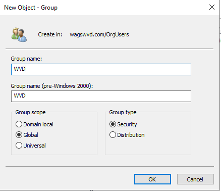
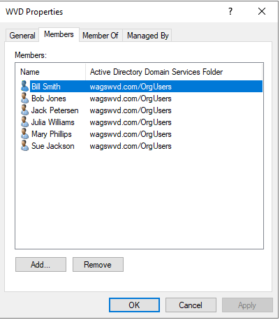
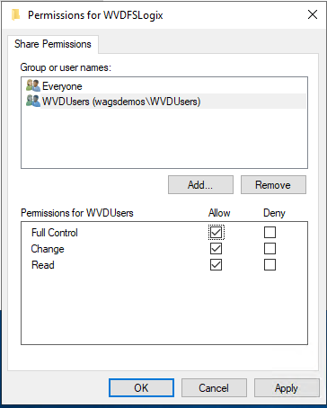
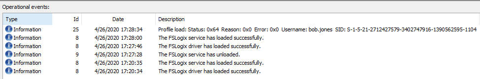
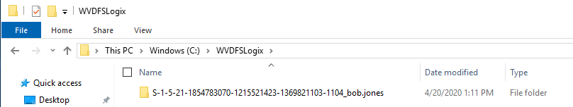

# FSLogix Installation and Configuration

In this lab you will install and configure FSLogix to utilize a share on your domain controller to host user profiles.

## Exercise 1 - Prepare a virtual machine to act as a file share for user profiles

1. Return to the RDP session to the domain controller.

2. In Active Directory Users and Computer (ADUC) navigate to toolbar and select the icon for **Create a new group in the current container**. Create a **New Global Group** with a Group Type of **Security** called **WVDUsers**.

    

3. Right-click **WVDUsers**, select **Properties**, click thed **Members** tab, and add the the following users from the Users OU into the WVDUsers group:
    * Bob Jones
    * Julia Williams  

    

    > This security group will be used to authenticate the Windows Virtual Desktop users to the file share you will create.

4. Open File Explorer on the domain controller and create a folder on the C: drive called **WVDFSLogix** that will be used as the profile share.

5. Right-click **WVDFSLogix**, select **Properties**, select the **Sharing** tab, and then select **Advanced sharing...**.

6. Select the checkbox for **Share this folder**, then click on  **Permissions...**, then ckick on **Add...**.

7. Search for the **WVDUsers** group to which you added the Windows Virtual Desktop
    users, then make sure that group has **Full Control**.

    

8. After adding the security group, right-click the folder, select
    **Properties**, select **Sharing**, then copy down the **Network Path** of `\\DC01\WVDFSLogix` to use for later.

## Exercise 2 - Installing the FSLogix agent

Installing the FSLogix agent can be done a few different ways. In this exercise we will install it via double hop RDP method where we will leverage the existing RDP session to the domain controller and then from there RDP into the session hosts to install the agent.

1. From within the RDP session of the domain controller by clicking on the **Start button** then selecting **Remote Desktop Connection** from the Start menu.  Establish an RDP session to the first session host from the **Personal Pool** which should be 10.10.10.4. If you connect and do not see Bob's profile, look for the correct IP address in the Azure Portal.

2. Logon to Windows 10 with the domain administrator credentials `<yourADdomain>\adadmin` and a password of `Complex.Password`.  You will have to click on **MOre choices** and then **Use a different account**.

3. In previous labs Bob Jones logged into this session host and a cached profile was created. For the FSLogix profile container to take priority over the locally cached profile, you will need to **Delete** the locally cached profile for user `C:\Users\bob.jones`.
    * Stop the Windows Search service prior to deleting the profile:
        * Right-click on the **Windows Start** button and select **Computer Management**.
        * Expand **Services and Applications**.
        * Click on **Services**.
        * Scroll-down and select the **Windows Search**.
        * Right-click and select **Stop**.
    * Confirm that bob.jones is connected:
        * On the Task Bar open **Task Manager**.
        * Click on **More details**
        * If **bob.jones** is listed, select **bob.jones**, right-click and select **Sign off**.
        * Click on **Sign out user**
    * Right-click the **Start menu** button and choose **File Explorer**.
    * Navigate to the `C:\Users` directory.
    * Select and then right-click the `C:\Users\Bob.Jones` directory and select **Delete**.

4. Within the Windows 10 VM (not the domain controller), launch Microsoft Edge and navigate to [Download and Install FSLogix](https://docs.microsoft.com/fslogix/install-ht).  Scroll down to **Download FSLogix** and click on  **here**.

5. Click **Open**, then **Compressed Folder Tools**, then **Extract All**, then **Extract**.

6. Navigate to the extraction folder, then **x64** directory, then **Release** folder, and run **FSLogixAppsSetup** to install the FSLogix agent.  

7. Navigate to the `\x64\Release` folder and double-click on **FSLogixAppsSetup**. Complete a default installation.

8. Back in FIle Explorer, navigate to **Program Files** \> **FSLogix** \> **Apps** to confirm the agent installed.  You should see numerous files and folders.

9. Open a Command Prompt and run **RegEdit32** as an administrator. Navigate to **Computer\\HKEY_LOCAL_MACHINE\\software\\FSLogix\\**.

10. Still within Windows 10, click the **Start menu** button, click on the letter **W**, expand **Windows PowerShell**, and then open PowerShell

11. Execute the following commands:

    ``` powershell
    #Create the key
    New-Item -Path HKLM:\Software\FSLogix\ -Name Profiles –Force

    #Create Enabled
    Set-ItemProperty -Path HKLM:\Software\FSLogix\Profiles -Name "Enabled" -Type "Dword" -Value "1"

    #Create the VHDLocations
    New-ItemProperty -Path HKLM:\Software\FSLogix\Profiles -Name "VHDLocations" -Value \\DC01\WVDFSLogix -PropertyType MultiString -Force

    #Create the SizeInMBs
    Set-ItemProperty -Path HKLM:\Software\FSLogix\Profiles -Name "SizeInMBs" -Type "Dword" -Value "32768"

    #Create IsDynamic
    Set-ItemProperty -Path HKLM:\Software\FSLogix\Profiles -Name "IsDynamic" -Type "Dword" -Value "1"

    #Create LockedRetryCount
    Set-ItemProperty -Path HKLM:\Software\FSLogix\Profiles -Name "LockedRetryCount" -Type "Dword" -Value "1"

    #Create LockedRetryInterval
    Set-ItemProperty -Path HKLM:\Software\FSLogix\Profiles -Name "LockedRetryInterval" -Type "Dword" -Value "0"
    ```

12. Return to Registry Editor, then select **View** then **Refresh** and confirm your settings:

    

13. **Restart** the Windows 10 virtual machine.

## Exercise 3 - Confirm FSLogix Functionality

1. From the domain controller launch the Remote Desktop Connection.
2. Confirm the **Computer:** is set to  **10.10.10.4** and click **Connect**.
3. When prompted to **Enter your credentials** click on **More choices** and then **User a different account** abd enter the credentials for Bob Jones:
    * Username: `<yourADdomain>\Bob.Jones`
    * Password: `Complex.Password`

    > During the logon process you may see a statement about FSLogix.

4. You can get a status if the FSLogix agent works by launching **FRXTray** that resides in `C:\Program Files\FSLogix\Apps`.

5. Click on **Show hidden icons** from the Windows 10 task bar and then click on the traffic light, then **Open**.  The light should be green.

    > Note: Sometimes the Profile status may not show green right away.

6. From the agent, click on “**Advanced view**” and then go to **Operational** located under **Events**. Confirm that you all **Informational** events in the logs.

    

7. Sign out from your Windows 10 session and return to the desktop of the domain controller. (Right-click **Windows Start**, then select **Shut down or sign out**, then select **Sign out**).

8. Return to File Explorer on the domain controller and open the **WVDUsersFSLogix** directory.

9. Your should see a new folder for the profile of Bob Jones.

    

### Return to [Optimize Phase Labs](optimize.md)
