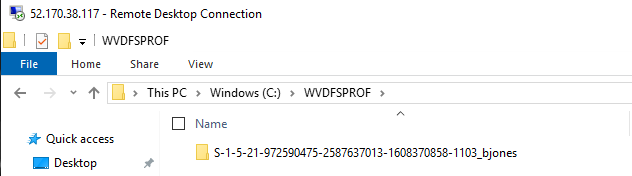

# FSLogix Installation and Configuration

In this lab you will install and configure FSLogix to utilize a share on your domain controller to host user profiles.

## Exercise 1 - Prepare a virtual machine to act as a file share for user profiles

1. Open the RDP session to the domain controller.

2. In Active Directory Users and Computer (ADUC) navigate to toolbar and select the icon for **Create a new group in the current container**. Create a **New Global Group** with a Group Type of **Security** called **WVDUsers**.

    

3. Add the the following users from the Users OU into the WVDUsers group:
    * Bob Jones
    * Julia Williams  

    

    > This security group will be used to authenticate the Windows Virtual Desktop users to the file share you just created.

4. Open File Explorer on the domain controller and create a folder on the C: drive called **WVDFSLogix** that will be used as the profile share.

5. Right-click **WVDFSLogix**, select **Properties**, select **Sharing**, then select **Advanced sharing...**.

6. Select **Share this folder**, select **Permissions...**, then select
    **Add...**.

7. Search for the **WVDUsers** group to which you added the Windows Virtual Desktop
    users, then make sure that group has **Full Control**.

    

8. After adding the security group, right-click the folder, select
    **Properties**, select **Sharing**, then copy down the **Network Path** to use for later.

## Exercise 2 - Installing the FSLogix agent

Installing the FSLogix agent can be done a few different ways. In this exercise we will install it via double hop RDP method where we will leverage the existing RDP session to the domain controller and then from there RDP into the session hosts to install the agent.

1. From within the RDP session of the domain controller by clicking on the **Start button** then selecting **Remote Desktop Connection** from the Start menu.  Establish an RDP session to the first session host from the **Personal Pool** which should be 10.10.10.4. If you connect and do not see Bob's profile, look the the correct IP address in the Azure Portal.

2. Login with the domain administrator credentials `<yourADdomain>\adadmin` and a password of `Complex.Password`.  

3. In previous labs the end user Bob Jones was able to login to the session host. Once that user logged in a locally cached profile was created. For the FSLogix profile container to take priority over the locally cached profile, you will need to **Delete** the locally cached profile for user     `C:\Users\BJones`.
    * Right-click the Start menu and choose **File Explorer**.
    * Navigate to the `C:\Users` directory.
    * Stop the Windows Search service prior to deleting the profile:
        * Right-click on the Windows Start button and select **Computer Management**.
        * Scroll-down and select the **Windows Search**.
        * Right-click and select **Stop**.
    * Back in File Explorer right-click the `C:\Users\BJones` directory and select **Delete**.

    > If you are still unable to delete the profile, Bob Jones might be disconnected.  Open Task Manager, click the **Users** tab, and if Bob Jones is listed right-click and select **Disconnect**.

4. Launch Microsoft Edge and navigate to [Download and Install FSLogix](https://docs.microsoft.com/fslogix/install-ht).

5. Click **Open**, then **Compressed Folder Tools**, then **Extract All**, then **Extract**.

6. Navigate to extraction folder, thex **x64** directory, then **Release** folder, and run **FSLogixAppsSetup** to install the FSLogix agent.  Complete a default installation.

7. Navigate to **Program Files** \> **FSLogix** \> **Apps** to confirm the agent installed.

8. Open a Command Prompt and run **RegEdit32** as an administrator. Navigate to     **Computer\\HKEY_LOCAL_MACHINE\\software\\FSLogix\\**..

9. Open PowerShell and execute the following commands:

    ``` powershell
    #Create the key
    New-Item -Path HKLM:\Software\FSLogix\ -Name Profiles –Force

    #Create Enabled
    Set-ItemProperty -Path HKLM:\Software\FSLogix\Profiles -Name "Enabled" -Type "Dword" -Value "1"

    #Create the VHDLocations
    #EDIT THE \\SHARE\VOLUME value you saved earlier
    New-ItemProperty -Path HKLM:\Software\FSLogix\Profiles -Name "VHDLocations" -Value \\yoursharename\yourvolumename -PropertyType MultiString -Force

    #Create the SizeInMBs
    Set-ItemProperty -Path HKLM:\Software\FSLogix\Profiles -Name "SizeInMBs" -Type "Dword" -Value "32768"

    #Create IsDynamic
    Set-ItemProperty -Path HKLM:\Software\FSLogix\Profiles -Name "IsDynamic" -Type "Dword" -Value "1"

    #Create LockedRetryCount
    Set-ItemProperty -Path HKLM:\Software\FSLogix\Profiles -Name "LockedRetryCount" -Type "Dword" -Value "1"

    #Create LockedRetryInterval
    Set-ItemProperty -Path HKLM:\Software\FSLogix\Profiles -Name "LockedRetryInterval" -Type "Dword" -Value "0"
    ```

10. Return to Registry Editor, then select **View** then **Refresh** and confirm your settings:

    

## Exercise 3 - Confirm FSLogix Functionality

1. Restart the session host and then login again as Bob Jones to create the user profile.
    * From your desktop launch the Remote Desktop client.
    * When prompted enter the credentials for Bob Jones:
        * Username: `Bob.Jones@<yourdomain>.onmicrosoft.com`
        * Password: `Complex.Password`

    > During the logon process your should see a statement about FSLogix.

2. You can get a status if FSLogix agent works by launching FRXTray that in:
    “C:\\Program Files\\FSLogix\\Apps”

3. Then click on the traffic light that is in the tray. The light should be
    green.

    

    > Note: Sometimes the Profile status may not show green right away.

4. Click on “**Advanced view**” and then go to “**Operational**” and look if you have no issue in the logs.

    

5. The agent needs to be installed on **each WVDUsers session host**. If time permits, repeat the steps on the other virtual machine in the pool.

6. Disconnect from your session and return to the desktop of the domain controller.

7. Return to File Explorer and open the **WVDUsersFSLogix** directory.

8. Your should see a new folder for the profile of Bob Jones.

    

### Return to [Optimize Phase Labs](optimize.md)
