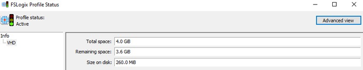
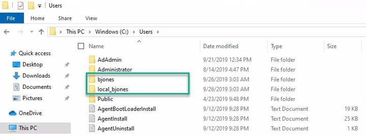

# Lab 13: FSLogix Agent Installation

## Exercise 1 - Prepare the virtual machine to act as a file share for user profiles

The following are [general
instructions](https://docs.microsoft.com/en-us/azure/virtual-desktop/create-host-pools-user-profile)
about how to prepare a virtual machine to act as a file share for user profiles:

1. Open the RDP session to the domain controller.

2. In Active Directory Users and Computer (ADUC) navigate to the **OrgUsers**
    OU. Create a **New Global Group** with a Group Type of **Security** called **WVD**.

    

3. Add the four AD users from the ORGUsers OU into the new group called **WVD**

4. This security group will be used to authenticate the Windows Virtual Desktop
    users to the file share virtual machine you just created.

5. On the domain controller create a folder on the **C drive** called
    **WVDFSPROF** that will be used as the profile share.

6. Right-click the new folder, select **Properties**, select **Sharing**, then select **Advanced sharing...**.

7. Select **Share this folder**, select **Permissions...**, then select
    **Add...**.

8. Search for the **WVD** group to which you added the Windows Virtual Desktop
    users, then make sure that group has **Full Control**.

9. After adding the security group, right-click the folder, select
    **Properties**, select **Sharing**, then copy down the **Network Path** to     use for later.

## Exercise 2 - Installing the FSLogix agent

Installing the FSLogix agent can be done a few different ways. In this exercise we will install it via double hop RDP method where we will leverage the existing RDP session to the domain controller and then from there RDP into the session hosts to install the agent.

1. From within the RDP session of the domain controller open **MSTSC.**
    Establish an RDP session to the first session host which should be 10.0.1.5,
    however you should verify the IP is correct by locating it in the Azure
    portal.

2. Login with the domain administrator credentials **MyADDomain\\adadmin** and password of **WVD\@zureL\@b2019!**

3. In the previous labs the end user Bob Jones was able to login to the session
    host. Once that user logged in a locally cached profile was created. For the
    FSLogix profile container to take priority over the locally cached profile,
    you will need to **Delete** the locally cached profile for user
    **C:\\Users\\BJones**. *Note: You may need to stop the Windows Search
    service prior to deleting the profile.*

4. Launch an internet browser and navigate t[o this
    link](https://docs.microsoft.com/fslogix/install-ht) to download the FSLogix
    agent.

5.  **Unzip** the file.

6.  Navigate to \\\\X64\\Release in the .zip file and run **FSLogixAppsSetup**
    to install the FSLogix agent.

7.  Navigate to **Program Files** \> **FSLogix** \> **Apps** to confirm the
    agent installed.

8.  From the start menu, run **RegEdit** as an administrator. Navigate to
    **Computer\\HKEY_LOCAL_MACHINE\\software\\FSLogix\\Profiles**

9.  Create\\Set the following registry keys

| **Name**            | **Type**           | **Data/Value**                                 |
|---------------------|--------------------|------------------------------------------------|
| Enabled             | DWORD              | 1                                              |
| VHDLocations        | Multi-String Value | "Network path for file share"                  |
| SizeInMBs           | DWORD              | "integer for size of profile" for example 3000 |
| IsDynamic           | DWORD              | 1                                              |
| LockedRetryCount    | DWORD              | 1                                              |
| LockedRetryInterval | DWORD              | 0                                              |

For VHDLocations, use the share folder previously created on the DC.

``` powershell
#Add FSLogix settings 
New-Item -Path HKLM:\Software\FSLogix\ -Name Profiles –Force 
Set-ItemProperty -Path HKLM:\Software\FSLogix\Profiles -Name "Enabled" -Type "Dword" -Value "1" 
New-ItemProperty -Path HKLM:\Software\FSLogix\Profiles -Name "VHDLocations" -Value \\share\volume -PropertyType MultiString -Force 
Set-ItemProperty -Path HKLM:\Software\FSLogix\Profiles -Name "SizeInMBs" -Type "Dword" -Value "32768" 
Set-ItemProperty -Path HKLM:\Software\FSLogix\Profiles -Name "IsDynamic" -Type "Dword" -Value "1" 
Set-ItemProperty -Path HKLM:\Software\FSLogix\Profiles -Name "LockedRetryCount" -Type "Dword" -Value "1" 
Set-ItemProperty -Path HKLM:\Software\FSLogix\Profiles -Name "LockedRetryInterval" -Type "Dword" -Value "0"
```

>   If you want to know what the settings are for go check this web page:

>   [https://docs.microsoft.com/en-us/fslogix/configure-profile-container-tutorial
>   ](https://docs.microsoft.com/en-us/fslogix/configure-profile-container-tutorial)

1.  Restart the session host at this time and login again to create the user
    profile. Login as the user: 1. User Name: *bob.jones@MyADDomain.com*

>   2. Password: **WVD\@zureL\@b2019!**

1.  You can get a status if FSLogix agent works by launching FRXTray that in:
    “C:\\Program Files\\FSLogix\\Apps”

2.  Then click on the traffic light that is in the tray. The light should be
    green.


Note: Sometimes the Profile status may not show green right away.



1.  Click on “**Advanced view**”

2.  Go to “**Operational**” and look if you have no issue in the logs.


1.  The agent needs to be installed on **each WVD session host**. Repeat steps 1

#### Task 3: Testing user profile containers with the FSLogix agent

Once the FSLogix agent has been installed a session needs to be established to
the session host to verify that the profile container is mounted.

1.  Launch a browser in privacy or incognito mode and visit
    <http://aka.ms/wvdweb> to access the HTML5 client.

2.  Authenticate using the login information

    1.  User Name: *bob.jones@MyADDomain.com*

    2.  Password: **WVD\@zureL\@b2019!**

3.  Click the Windows 10 Desktop Icon. Click Allow for Local Resources

4.  Once logged into the WVD session as Bob Jones, Navigate to
    C:\\windows\\users

5.  If the Fslogix agent is contacting the shared path there will be two
    directories for Bob Jones.

    1.  Local_bjones is the local Windows User Profile

    2.  Bjones is the VHD attached profile mounted via the filter driver for
        FSLogix



1.  The VHDX mounted profile container can be seen also by going to th[e
    \\\\servername\\Sharename](file://servername/Sharename) created earlier.

2.  If the VHDX is there with a SID after the user logs in, then the process is
    complete

>   A. If the VHD is not there, then open the log file
>   **C:\\ProgramData\\FSLogix\\Logs\\Profile** from the session host the user
>   is logged into and look for potential errors, resolve, then test user login
>   again.

1.  Once step 4 is complete we can test a simple file redirection to the VHDX
    file.

2.  On the desktop of Bob Jones create a **SuperSecretWorldDomination.docx**
    file or similar

3.  To explore the VHD that is mounted to the user Bob Jones in the **run**
    window type **diskmgmt.msc** and then click **Run As administrator** then
    enter the domain admin credentials

>   Note: this is should NOT be done in a customer’s production environment and
>   solely for the purpose of education.

1.  Locate the Disk 2 or similar that is the 29GB or so VHD container in disk
    management.

2.  Add a drive letter **E:** and mount the VHD drive

3.  Open **explorer** located the newly mounted E: drive

4.  Navigate to E:\\Profile\\Desktop

5.  The SuperSecretWorldDomination.docx file will appear.

6.  From the desktop of Bob Jones, **delete** the
    SuperSecretWorldDomination.docx file. The file will then disappear from
    E:\\Profile\\Desktop

7.  From Diskmgmt.msc detach the E: drive.

#### Task 4: Install DICOM viewer

Use Application Masking to manage user access of installed components.
Application Masking may be used in both physical and virtual environments.
Application Masking is most often applied to manage non-persistent, virtual
environments, such as Virtual Desktops. In order to test and apply application
masking to a sample application like Notepad ++, the application needs to be
installed.

1.  In the previous exercise a HTML 5 session as a test user Bob Jones was
    established.

2.  session to the desktop.

3.  Download Dicom viewer to the session host from the lin[k here
    ](http://www.microdicom.com/component/jdownloads/send/3-software/346-microdicom-viewer-3-0-1-x64.html)

4.  Locate the exe for Dicom exe and **Run as Administrator** to start the
    install

5.  Run the DICOM viewer after the install 6. Click **Yes** to set DICOM viewer
    as the default.

6.  On the desktop the MicroDicom app will appear

7.  Repeat the installation of the DICOM application on any additional sessions
    hosts created by establishing an RDP session from your domain controller to
    the IP of those sessions hosts.

#### Task 5: Install FSLogix Rule Editor 

In this next task a rule set for denying access to a Bob Jones will be applied
for the recently installed application DICOM.

>   1. Install the **FSLogix Rule Editor**. This exe can be located in the zip
>   file that was downloaded earlier in Task 2. Right click on the
>   **FSLogixAppsRuleEditorSetup.exe** and **run as administrator** to start the
>   install

#### Task 6: Create and Test Rule Set

1.  **Run As Administrator** the FSLogix Rule Editor in the session **host
    C:\\Program Files\\FSLogix\\Apps\\RuleEditor.exe**

2.  Click **File** then **New** to create a new Rule Set

3.  Enter the name that you would like for your Rule Set. Call this **DICOM**

4.  Click **Enter file Name** to create the rule set

5.  Select the application that you would like to manage. Select **MicroDicom
    DICOM viewer 3.0.1**

6.  Click **Scan** to have the Rules Editor detect the application settings

7.  When scanning is complete, Click **OK**

8.  The Rules Editor now shows your first Rule Set

#### Task 7: Assign users to Rule Set

1.  Click **File** then **click manage assignments**

2.  **The everyone group is who the rule set is applied to.** Click **remove**
    and click **Add.** Click **User** 3. Look up **Bob Jones** account in
    AD**.** Click **Ok** to apply this **rule.**

3.  **Copy** the rule file to the FSLogix's rules directory. By default under *C:\Program Files\FSLogix\Apps\Rules*

    ```PowerShell
    #Run as Administrator
    Get-ChildItem "$env:userprofile\documents\FSLogix Rule Sets" |
    ForEach-Object { Copy-Item -Path $_.FullName -Destination "$env:ProgramFiles\FSLogix\Apps\Rules" }
    ```

    > <span style="background-color: #006600"><span style="color: white">**Note**<span style="color: white">: The rule files (.xfr) and assignment files (.fxa) must be copied to all session hosts where the rule should apply.</span>

4.  The Rules that are within your Rule Set will be applied to your system. The
    icon for DICOM will disappear from Bob Jones desktop.

5.  Apply the reverse process to make the application appear back for Bob Jones
    on his desktop.
