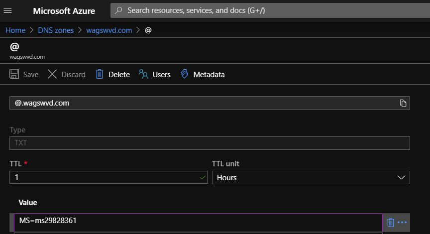
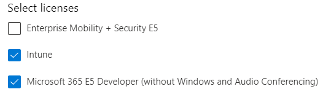

# Lab 15: Managing Windows Virtual Desktop with Intune

These set-up steps help you enable mobile device management (MDM) by using Intune. Devices must be managed before you can give users access to company resources or manage settings on those devices.

## Exercise 2 - Activate your Microsoft 365 subscription

This exercise assumes you have a Visual Studio Enterprise subscription.  

*NOTE: DO NOT complete these steps if you have an Office 365 subscription with an Enterprise Mobility + Security (EMS) E5 license environment.  Return to the [Prepare Phase Labs](prepare.md) and continue subsequent labs.*

1. Navigate to the [My Visual Studio](https://my.visualstudio.com) benefits page. If prompted, sign in with your credentials.
2. Locate the **Microsoft 365** tile in the **Tools** category and click **Activate**.  

3. If prompted, sign in with your credentials.
4. Click on **SET UP SUBSCRIPTION**
5. Enter the following information and click **Continue**:
    * Create username: *yourfirstname*
    * Create domain: WVD*yourinitials*Lab (e.g. WVDXYZLab).  Hit **Tab**.
        *Ensure validation passes as your namespace needs to be unique within the onmicrosoft.com namespace.  We often see students choosing a domain name that already exists.*
        ***Write this domain name down as your Azure Active Directory Domain Name.***
    * Password: **Complex.Password**
    * Confirm Password: **Complex.Password**

        
6. Enter your cell phone number and click **Send Code**.
7. Enter your activation code and click **Set up**.
8. Click on **Go to subscription**.

## Exercise 3 - Activate your Enterprise Mobility + Security (EMS)

1. Return to the [My Visual Studio](https://my.visualstudio.com) benefits page.
2. Locate the **Enterprise Mobility + Security (EMS)** tile in the **Tools** category and click **Get Code**.

    

3. When the coupon code has been successfully retrieved, click **"Activate"** to proceed.
4. If prompted, select **Yes, add it to my account**, otherwise choose **Try now**.
5. Note your confirmation number and click **Continue**.

## Exercise 1 - Optional: Configure a custom domain name

> **NOTE: IT IS NOT REQUIRED TO SETUP A CUSTOM DOMAIN NAME TO COMPLETE THIS LAB.  IF YOU ARE INTERESTED IN DOING THIS AND ACCEPT THAT YOU WILL BE GENERATING A REAL DOMAIN NAME AND ACCEPT THE ASSOCIATED FEES PLEASE CONTINUE WITH EXERCISE 1, OTHERWISE PROCEED TO EXERCISE 2.**

When your organization signs up for a Microsoft cloud-based service like Intune, you're given an initial domain name hosted in Azure Active Directory (AD) that looks like your-domain.onmicrosoft.com. In this example, your-domain is the domain name that you chose when you signed up. onmicrosoft.com is the suffix assigned to the accounts you add to your subscription. You can configure your organization's custom domain to access Intune instead of the domain name provided with your subscription.

Before you create user accounts or synchronize your on-premises Active Directory, we strongly recommend that you decide whether to use only the `.onmicrosoft.com` domain or to add one or more of your custom domain names. Set up a custom domain before adding users to simplify user management. Setting up a customer domain lets users sign in with the credentials they use to access other domain resources.

We will be using the  Azure App Service to buy a custom domain.  Your app's App Service plan must be a paid tier (Shared, Basic, Standard, or Premium). In this step, you make sure that the app is in the supported pricing tier.

### Create an App Service Plan

1. Open the [Azure Portal](https://portal.azure.com/#create/hub) to the Create Hub and search for and select **App Service Plan**, then click **Create**.
2. On the Basics tab complete the following: 
    * Resource Group: **WVDLab**
    * Name: WVDAppPlan
    * Operating System: Windows
    * Region: **Select the same region as your other WVD Resources**
    * Sku and size: Change to Shared D1
        * > This is the least expensive plan that supports custom domain names.
3. Click **Review + Create** and then **Create**.
4. Once created, click on **Go to resource**.

### Create an Web App

1. In the Azure Portal click on **+Create a resource**.
2. In the search bar type in and select **Web App** followed by **Create**.
3. On the Basics tab complete the following: 
    * Resource Group: **WVDLab**
    * Name: `<yourinitials>`WVD (e.g. abcWVD)
        > Ensure the domain name resolves in the .azurewebsites.net namspace.
    * Runtime stack: **>NET Core 3.1 (LTS)
    * Region: **Select the same region as your other WVD Resources**
    * Ensure your App Service Plan is selected.
4. Click **Review + Create** and then **Create**.
5. Once created, click on **Go to resource**.

### Buy the domain

1. In the App Services tab, under Settings, select Custom domains.
2. Scroll down in the main window and click **Buy Domain**.
    > Note: If you cannot see the App Service Domains section, you need to remove the spending limit on your Azure account.

3. in the **Search for domain** enter the name of the custom domain you want to purchase and hit **Tab**.
4. Complete the rest of the form and click **OK**.  At this point you will be purchasing the domain name.

### To add and verify your custom domain

1. Go to [Microsoft 365 admin center](https://admin.microsoft.com/) and sign into your tenant with your administrator account.
2. In the navigation pane, choose **Setup > Domains**.
3. Choose Add domain, and then type in your custom domain name. Select **Use this domain**.
4. Follow the steps to add the TXT reecord to your DNS hosting provider.
5. Your DNS record should look like this, aside from the custom domain:

    
6. Continue to add the TXT, CNAME, and MX records to Azure DNS.

## Exercise 2 - Assign Licenses

In the [Microsoft Endpoint Manager admin center](https://go.microsoft.com/fwlink/?linkid=2109431), complete the following steps:

1. Select **Users > All Users > choose a user >** click on **Bob Jones**.
2. Select **Licenses** then **+Assignments** and select **Intune** and **Microsoft 365 E5 Developer (without Windows and Audio Conferencing)**.

    

3. Choose **Save** and then repeat the steps for **Julia Williams**.
    > If you get the error `License cannot be assigned to a user without a usage location specified.`, return to the user and under **Manage** click on **Profile** and then under **Settings** click **edit** and set their **uasge location** to the **United States** and click **Save**.  Repeat the steps to assign the license.

## Exercise 3 - Create a group

You will create a group that will be used manage objects. To create a group:

1. Once you've opened the Microsoft Endpoint Manager, select **Groups **> **+New group**.
2. In the Group type dropdown box, select **Security**.
3. In the Group name field, enter the name **Windows Virtual Desktops** for the new group.
4. Enter **WVD objects** as the Group description.
5. Set the Membership type to **Assigned**.
6. Under **Members**, select the link to add each of the following members:
    * Bob Jones
    * Julia Williams
    * `yourself` as the tenant administator
7. Click **Select** and then assign yourself (the tenant administrator) as the Owner.
8. Click **Create**

    

## Exercise 4 - Set up Windows 10 automatic enrollment

1. From the [Microsoft Endpoint Manager admin center](https://go.microsoft.com/fwlink/?linkid=2109431) select **Devices**.  Under **Device enrollment** select **Enroll devices** and then select **Automatic Enrollment**.
2. Select **Some** from the MDM user scope to use MDM auto-enrollment.
3. Under Groups find **Windows Virtual Desktops** and click **Select**.
4. Under MAM User scope click on **SOme**.
5. Find **Windows Virtual Desktops** and click **Select**.
6. Use the default values for the remaining configuration values and choose **Save**.

## Exercise 5 - Enroll your Windows 10 device

1. From your desktop, open the Remote Desktop client and select **PersonalPool**.
2. When prompted enter the credentials for Bob Jones.

### Return to [Optimize Phase Labs](optimize.md)
