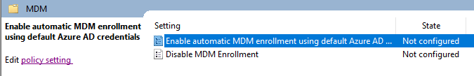
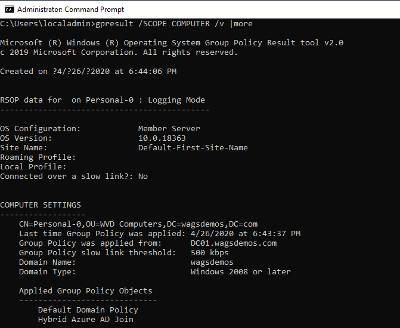
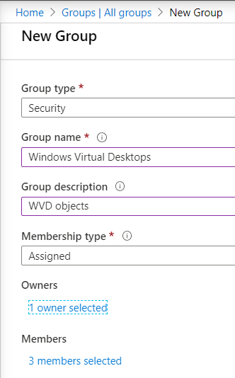

# Managing Windows Virtual Desktop with Intune

Intune provides mobile device management (MDM) and mobile app management (MAM) from a secure cloud-based service that is administered using the Microsoft Endpoint Manager admin center. Using Intune, you ensure your workforce's corporate resources (data, devices, and apps) are correctly configured, accessed, and updated, meeting your company's compliance policies and requirements.

>In this lab you are activating a free 30-day trial.

## Exercise 1 - Sign up for a Microsoft Intune free trial

1. Go to the [Microsoft Intune Trial](https://go.microsoft.com/fwlink/?linkid=2019088) page and fill out the form.

2. Sign in with your Azure Credentials.

3. Click **Try now** on the **Check out confirm your order** page. Click **Continue**. You are now at the **Microsoft 365 admin center**.

## Exercise 2 - Configure auto enrollment

1. Return to the domain controller and open **Server Manager**.
2. Under **Tools**, select **Group Policy Management**.
3. Expand the **forest** and then select `<yourADdomain>`. Right-click and then selelct **Create a GPO in the domain, and Link it here...**.
4. Under **Name:** enter **Hybrid Azure AD Join** and click **OK**.
5. Select the **Hybrid Azure AD Join** GPO, right-click and click **Edit**.
6. Select and expand **Computer Configuration**, then **Policies**, then **Administrative Templates**, then **Windows Components**, then select  **MDM**.
7. Right-click the **Enable automatic MDM ...** setting and select **Edit**.

    

8. Click the radio button for **Enabled** and then click **OK**.
9. Browse up the tree in the Group Policy Management Editor and select  **Device Registration**.
10. Select the **Register domain joined commputers as devices** setting and click **Edit policy setting**.
11. Click the radio button for **Enabled** and then click **OK**.
12. Exit the Group Policy Management Editor.

## Exercise 3 - Configure Group Policy

### Create an Organizational Unit

1. From the domain controller return to **Active Directory Users and Computers**.
2. Select your domain, right-click and select **New** then **Organizational Unit**.
3. Enter **WVD Computers** and click **OK**.

### Move WVD Computers to the New OU

1. Select the **Computers** container.
2. Select all the computer names that start with **Personal-** or **Pooled-**.
3. Right-click and select **All Tasks** and then **Move**.  Browse to the **WVD Computers OU** and click **OK**.

### Apply the GPO

1. From the domain controller launch Remote Desktop Connection.
2. Confirm the **Computer:** is set to  **10.10.10.4** and click **Connect**.
3. When prompted to **Enter your credentials** click on **More choices**, then **User a different account**, then enter the following credentials:
    * Username: `<yourADdomain>\adadmin`
    * Password: `Complex.Password`

    > During the logon process you may see a statement about FSLogix.

4. Open a Command Prompt and enter the following:

     `gpupdate /force`

5. Run the following:

    `gpresult /SCOPE COMPUTER /v |more`

6. Check the results to ensure the **Hybrid Azure AD Join** group policy is applied.

    

## Exercise 4 - Assign Licenses

In the [Microsoft Endpoint Manager admin center](https://go.microsoft.com/fwlink/?linkid=2109431), complete the following steps:

1. Select **Users > All Users > choose a user >** click on **Bob Jones**.
2. Select **Manage product licenses**,  select the checkbox for **Intune** and then click  **Save changes**.
3. Repeat the steps for **Julia Williams**.
    > If you get the error `License cannot be assigned to a user without a usage location specified.`, return to the user and under **Manage** click on **Profile** and then under **Settings** click **edit** and set their **uasge location** to the **United States** and click **Save**.  Repeat the steps to assign the license.

## Exercise 5 - Set up Windows 10 automatic enrollment

1. Logon to the [Microsoft Endpoint Manager admin center](https://go.microsoft.com/fwlink/?linkid=2109431) as `AzureADAdmin@<yourAzureADdomain..onmicrosoft.com`

2. select **Devices**.  Under **Device enrollment** select **Enroll devices** and then select **Automatic Enrollment**.
3. Select **Some** from the MDM user scope to use MDM auto-enrollment.
4. Under Groups find **Windows Virtual Desktops** and click **Select**.
5. Under MAM User scope click on **SOme**.
6. Find **Windows Virtual Desktops** and click **Select**.
7. Use the default values for the remaining configuration values and choose **Save**.

## Exercise 5 - Enroll your Windows 10 device

1. From your desktop, open the Remote Desktop client and select **PersonalPool**.
2. When prompted enter the credentials for Bob Jones.

### Return to [Optimize Phase Labs](optimize.md)

## Exercise 3 - Create a group

You will create a group that will be used manage objects. To create a group:

1. Once you've opened the Microsoft Endpoint Manager, select **Groups**> **+New group**.
2. In the Group type dropdown box, select **Security**.
3. In the Group name field, enter the name **Windows Virtual Desktops** for the new group.
4. Enter **WVD objects** as the Group description.
5. Set the Membership type to **Assigned**.
6. Under **Members**, select the link to add each of the following members:
    * Bob Jones
    * Julia Williams
    * `yourself` as the tenant administator
7. Click **Select** and then assign yourself (the tenant administrator) as the Owner.
8. Click **Create**

    
