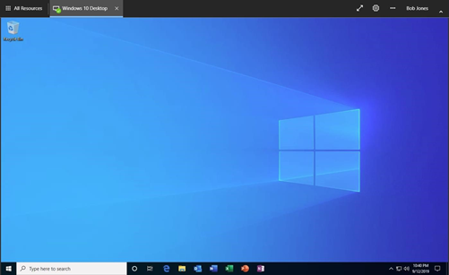
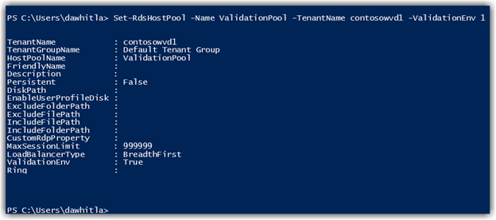
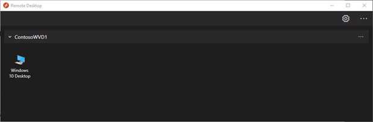
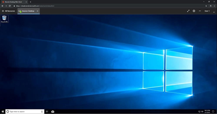

# Lab 8: Test Your WVD Deployment

Once you have created your Windows Virtual Desktop host pool, you can download
the client for
[Android](https://docs.microsoft.com/en-us/windows-server/remote/remote-desktop-services/clients/remote-desktop-android)
o[r Windows,](http://aka.ms/wvd/clients/windows) or use the HTML5 client. (The
Microsoft Remote Desktop Beta for iOS can be tested using
[TestFlight.](https://aka.ms/rdiosbeta)) Here’s how to test with Windows or the
RDP client.

Test with the HTML5 client 

Launch a browser in privacy or incognito mode and visit <http://aka.ms/wvdweb>
to access the HTML5 client.

Click the Windows 10 Desktop Icon. Click Allow for Local Resources

Authenticate using the login information

User Name: *bob.jones@contosowvd.com* Password: **WVD\@zureL\@b2019!**

If you are successful, the Remote Desktop Client Connection opened in the
previous task should close, and you should be able to view the same desktop via
your browser window.

Log off from the WVD session.

#### NOTE: Host Pool Validation Tag 

By default, the WVD agent on each host will auto update as new versions release.
You can prevent this behavior by setting the **ValidationEng** flag in a host
pool to true (by default it’s set to false). With the ValidationEng flag set to
true ONLY the host in that host pool will auto update giving administrators
control to test new WVD host images, and the newest agents before rolling to
production.

A single host pool in a WVD Tenant with the ValidationEng flag set to true will
prevent all other hosts in the WVD Tenant from auto updating. You can toggle the
ValidationEng flag via PowerShell to false at any time to allow the hosts in
that tenant to start auto updating.

For production WVD Tenants it’s a good practice to create a single host pool
with the ValidationEng flag set to true. When an administrator is comfortable
with the newest agent build the ValidationEng flag can be set to false.

To enable this setting follow the PowerShell steps below.

Open a PowerShell window.

Log onto the WVD Service with an WVD Tenant Owner and your Azure AD GA account
once prompted

>   Add-RDSAccount -DeploymentUrl
>   [https://rdbroker.wvd.microsoft.com](https://rdbroker.wvd.microsoft.com/)

Choose a Host Pool for the validation pool

Run

>   Set-RdsHostPool -Name \<HostPoolName\> -TenantName \<yourTenantName\>
>   -ValidationEnv \$True or

\$False

#### NOTE: Other Common Settings 

**WVD Tenant Friendly Name:** You can give your WVD Tenant a friendly name that
will look less technical

Set-RdsTenant -Name \<WVD Tenant\> -FriendlyName "Contoso WVD"

**DesktopFriendlyName:** Using the under the Set-RdsRemoteDesktop PowerShell
cmdlet the FriendlyName option allows you customize the name users see on the
Web Client or Thick Client.

>   Set-RdsRemoteDesktop -TenantName \<tenant\> -HostPoolName \<Host Pool\>
>   -AppGroupName "Desktop Application Group" -FriendlyName "Eng Host"

**Description:** This field can be used by administrators to give additional
detail about the HostPool

**Persistent:** By default, this is set to False. If you want to set a Host Pool
for persistence - designates a single Host to a single user - you can set this
flag to True. The first time the user logs in they will be assigned a host by
the WVD Service. Every subsequent time that user logs in they will be directed
to that same host. NOTE: This can ONLY be set at HostPool creation and cannot be
switched. Set by default to False. If you do not set the flag to True at HP
creation, you must destroy the HostPool and re-create to change.

**MaxSessionLimit:** Controls the number of users who can log onto HostPool
Hosts

**LoadBalancerType:** Two options

Breadth: As users log in their sessions are spread across all hosts in the Host
Pool evenly, giving users the most possible resources.

>   Depth: As users log in a host is filled to max user session before assigning
>   users to another host. This helps maximize host resource utilization and can
>   help reduce cost.

#### Task 1: Test with the Windows client 

Download the latest Windows Remote Desktop client: Once you click subscribe you
will be prompted to login. This login should be a VALID WVD user that has been
synced from Active Directory to Azure Active Directory and have either a Desktop
or Application group assigned to them. From the above steps we added bill smith
to the ‘Default desktop users’ group for example. Once you login you will find
the virtualized apps and desktops in the Start menu on a Windows 10 machine.

**Download** the latest Window[s Remote Desktop
Client.](http://aka.ms/wvd/clients/windows) **Install**. Open the app, then
click **Subscribe**.

User Name: *bob.jones\@contosowvd.com* or any one of the users created in the AD
deploy process Password: **WVD\@zureL\@b2019!**

#### Task 2: Test with the HTML5 client 

Launch a browser in privacy or incognito mode and visit <http://aka.ms/wvdweb>
to access the HTML5 client. Authenticate using the login information to which
you assigned a full desktop session.

When connecting to the desktop be sure to allow access to the clipboard/Printers
if you need to use those devices.

If you are successful, you should be able to view the desktop:

