# Lab 14: WVD Monitoring

The following describes the process for you to set up [monitoring](http://loganalytics.sepago.com/index.html) for your WVD environment. This solution uses a 3rd party partner available in our Azure Gallery. This is referred to as a ‘Microsoft Preferred Solution’. A Microsoft preferred solution is a cloud application selected for its quality, performance,
and ability to address customer needs in a certain industry vertical or solution area. A team of Microsoft experts validates solutions from partners with specific proven competencies and capabilities. These solutions are featured in our cloud marketplace storefronts, Azure Marketplace, and AppSource, as well as
in the Azure portal. Preferred solutions on AppSource can be discovered by industry verticals. Preferred solutions on Azure Marketplace and the Azure portal can be discovered across horizontal solution categories.

The Sepago Agent monitors each worker in your RDS or Citrix environment. The agent is focused on events, performance consumption, network activities and more regarding each user’s IT experiences. Workers in this context are Windows Remote Desktop Server or Windows 10\\MS, XenApp Servers and of course Windows Client
VDI’s (XenDesktop). The agents combine data from different sources and send them to your OMS Log Analytics workspace in Azure.

#### Task 1: Installation of Sepago agent for a new workspace

From the Azure Portal, you select create a resource and **search** for Azure Monitor
for RDS and Windows Virtual Desktop.


After selecting the Sepago agent, select the **Create** button as shown below.


Make sure you deploy the workspace in
**East US as that is where you can leverage the Interdependency agent**.

The installation will generate an empty Log Analytics Workspace.

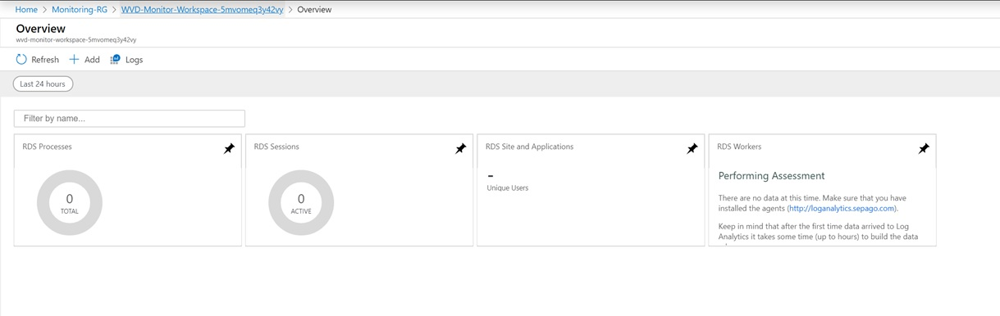

If you already have an existing Log Analytics workspace you can use the optional steps below to download and install the correct views.

#### Task 2 (Optional): Installation for an already existing workspace 

If you want to leverage an already existing Log Analytics workspace in **EAST US**, then all you need to do is import the views which can be downloaded from here, <https://github.com/MarcelMeurer/LogAnalytics-for-Citrix-and-RDS> . Extract the views to a temp folder for now. Open up Log Analytics workspace and
in the middle blade select view designer. Click import and browse to the view files you downloaded.

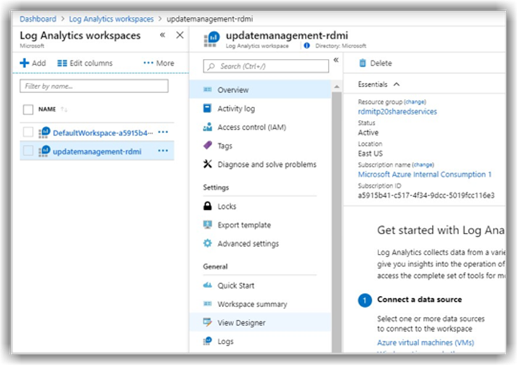

#### Task 3: Sepago Agent Installation

Once you have the workspace created above (or are using a workspace already
built) you need to deploy the Sepago agent to all your session hosts and\/or add the
agent to a master image. 

Your first step prior to downloading and installing the agent will be to obtain the Workspace ID and SharedKey from your Log Analytics workspace.

Within the Azure portal, navigate to your Log Analytics Workspace. Once there, navigate into Advanced Settings.

Locate the Workspace ID and copy it to Notepad.

Locate the Primary Key and copy it to Notepad.


**Download** the Sepago agent from [here.](http://loganalytics.sepago.com/download.html) onto each of your session hosts.


After downloading, **unzip** the file. In the extracted folder you will find a file called ITPC-LogAnalyticsAgent.exe.config. Edit that file in Notepad.

The default configuration file has placeholder entries for the CustomerId (Log Analytics Workspace ID) and SharedKey (Log Analytics Primary Key) as shown below.


Edit the file to replace the CustomerId with your Log Analytics Workspace ID (that you copied previously) and replace the SharedKey with your Log Analytics Primary Key (that you also copied previously).


**Save** changes to the file.

Open a cmd window as administrator. Change directory to where the agent has been extracted. Run the following command:

```Powershell
ITPC-LogAnalyticsAgent.exe -test
```

 You should see a "Sending test data" followed by "Done" at the end of your command output as shown below.

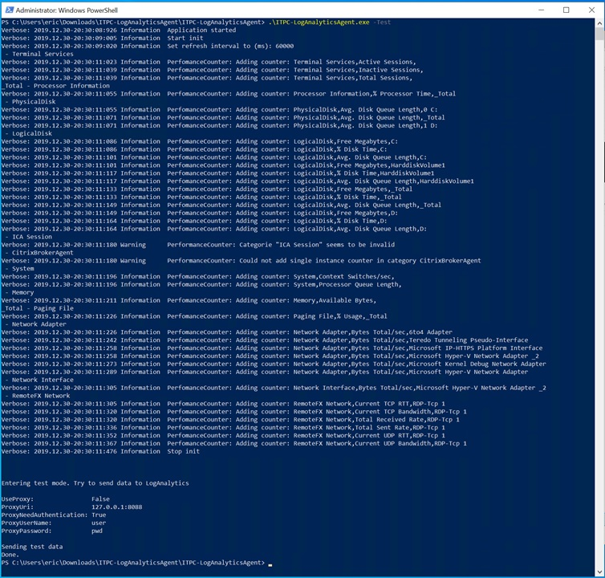

If instead you see the output stating “error”, there is a potential communication problem. Either the workspace ID or Key is incorrect or the session host can’t communicate to the LA Workspace due to networking.

Next, in your admin command prompt, run the following command to install the agent.

```Powershell
ITPC-LogAnalyticsAgent.exe -install
```

You will see the following output for a successful installation.


Remember to perform this installation on each Session Host. **Reboot** each Session Host after the installation is complete to ensure monitoring starts properly.

Log into one of your Session Hosts after the reboot is complete. Open **Task Scheduler**. Under Active Tasks, look for the task that starts with **ITPC-LogAnalyticsAgent for RDS**. This is the scheduled task to send metrics to the Log Analytics workspace.

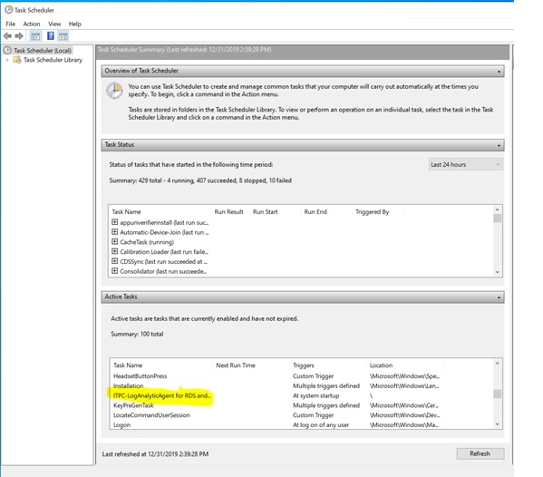

After some time you should see the following custom logs created in your Log Analytics workspace.


#### Task 4: Artificially Generate events

In a lab environment, to generate monitoring events, you may need to artificially apply activities to your Session Hosts. One way to generate monitoring events is to put a simulated load on the CPU of one of your session hosts.

To create a simulated load, you can perform the following:

* RDP into a session host as one of your WVD test users 
* Download ListDLLs from Sysinternals
* Use PowerShell to repeatedly run ListDLLs

Sample PowerShell (replace proper path below):

```powershell
$intCounter = 1
while ($intCounter -lt 100) {
        start-process "C:\users\<useraccount>\Downloads\ListDlls\ListDlls.exe"
        start-sleep 10
        $intCounter++
}
```

You may need to run ListDlls.exe once and accept the EULA before running the script above.

Let the script execute for several minutes. Wait some more time for the metrics to be reported into the Log Analytics workspace.

Navigate to the Log Analytics workspace.

Performance counters and performance metrics are captured in ITPC_CTX_PerfData_CL. To display a table of performance data results, use the following Kusto Query:

```kusto
ITPC_CTX_PerfData_CL
| where TimeGenerated > ago(1h)
| where Category == "Processor Information"
```

The results will be a table similar to the one shown below. You will see that one of your Session Hosts has a significant amount of CPU utilization (running ListDlls) while the other does not.

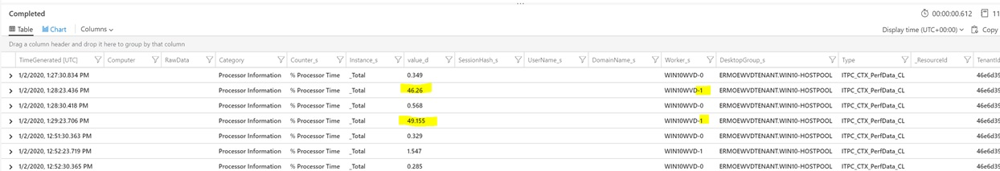

If you change the view to a timechart you can see the utilization over a time period (for instance, as shown below, a 24 hour period). We can see the two most active processes are the ListDLL64.exe and MsMpEng.exe (Defender AV scanning). Use the following KQL to generate a timechart:

```kusto
ITPC_CTX_Process_CL
| summarize avg(PercentProcessorTime_d) by Name_s, TimeGenerated
| where Name_s != "System Idle Process"
| order by avg_PercentProcessorTime_d desc
| take 20
| render timechart
```

and set the time range to 24 hours

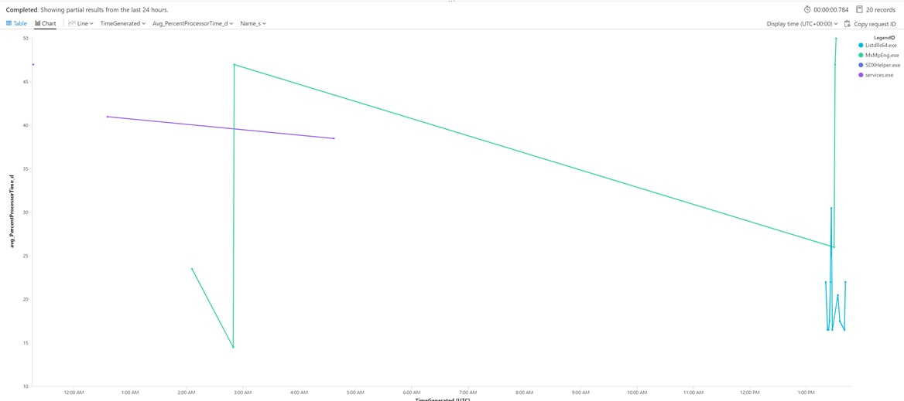

By setting the time range to last hour you can get a "zoom in" on the last hour of performance


We can look at individual process time with the following Query

```kusto
ITPC_CTX_Process_CL
| where TimeGenerated > ago(1h)
| where Name_s != "System Idle Process"
| order by PercentProcessorTime_d desc
| take 20
| render timechart
```

A common ask is to identify the different VM sizes being used in your host pools. In the lab environment, this will be a single-color pie chart.

```kusto
ITPC_CTX_Worker_CL
| summarize count() by VmSize_s
| render piechart
```


The following KQL query will indicate the session information for active sessions

```kusto
ITPC_CTX_Session_CL
| where TimeGenerated > ago(1h)
| project ConnectTime_t, LoginTime_t, UserName_s, ConnectionState_s, Worker_s, DesktopGroup_s
```


#### Task 5: Push WVD Tenant Diagnostics Data to Log Analytics Workspace

You can push your WVD tenant diagnostics data into Log Analytics. To do this, you must link your WVD tenant to our Log Analytics workspace. This requires TenantCreator rights to do this.

Since you have already set up your WVD tenant, you will need to run a command that is structured like the following to onboard it into Log Analytics:

```Powershell
Set-RdsTenant -Name 'TenantName' `
-AzureSubscriptionId 'SubscriptionID' `
-LogAnalyticsWorkspaceId 'String' `
-LogAnalyticsPrimaryKey 'String'
```

You should still have the WorkspaceId and Primary Key from when you onboarded the Sepago agent into Log Analytics. If not, retrieve those once again from your Log Analytics workspace and then you can paste them into your command string.

The following is an _example_ of onboarding your tenant. Be sure to use the correct WVD tenant name in the command.

```Powershell
$LogAnalyticsWorkspaceId = "46e6d39f-0589-xxxx-xxxx-aca9820168d2"
$LogAnalyticsPrimaryKey = "QvA9UlnmbuCa2p6lDLuvWecM3l+xxxxxxxxxxxxxxxxxxx+Y8d2NBz66HNYhFf9K019BvYea8g=="

Set-RdsTenant -Name ermoeWVDTenant -AzureSubscriptionId $azureSubscriptionId `
-LogAnalyticsWorkspaceId $LogAnalyticsWorkspaceId -LogAnalyticsPrimaryKey $LogAnalyticsPrimaryKey
```

After the command completes, run the following to verify the results return as shown below:

```powershell
Get-RdsTenant
```

The results should have a non-null LogAnalyticsWorkspaceId and a non-null LogAnalyticsPrimaryKey

```Powershell
TenantGroupName         : Default Tenant Group
AadTenantId             : 72a1f911-0dfc-xxxx-xxxx-b6c359309987
TenantName              : ermoeWVDTenant
Description             : 
FriendlyName            : 
SsoAdfsAuthority        : 
SsoClientId             : 
SsoClientSecret         : 
AzureSubscriptionId     : 34be8fb2-7dd2-xxxx-xxxx-2fca626ff4e7
LogAnalyticsWorkspaceId : 46e6d39f-0589-xxxx-xxxx-aca9820168d2
LogAnalyticsPrimaryKey  : ********
```

After onboarding, navigate back to your Log Analytics workspace. You will see additional custom logs:

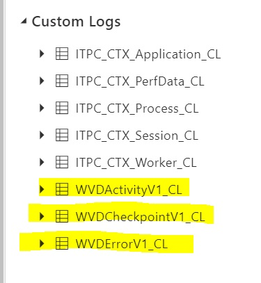

You can query on WVD activity through the following Kusto Query:

```kusto
WVDActivityV1_CL
| where TimeGenerated > ago(24h)
| limit 10
```


You can query WVD checkpoint activity through the following Kusto Query:

```kusto
WVDCheckpointV1_CL
| where TimeGenerated > ago(24h)
| limit 10
```

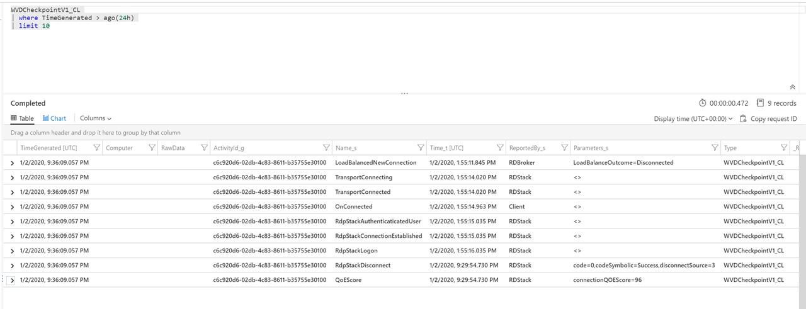

You can query for WVD tenant errors through the following Kusto Query:

```kusto
WVDErrorV1_CL
| where TimeGenerated > ago(24h)
| limit 10
```

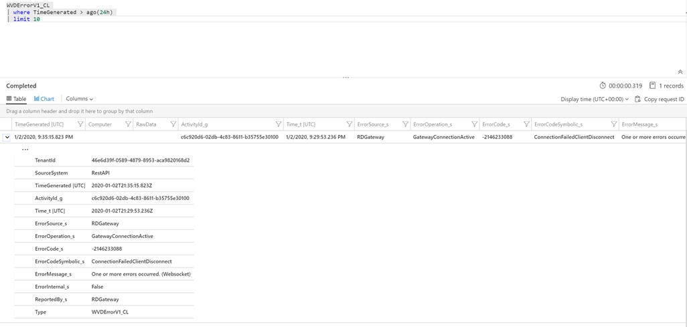

RDP to one or more Session Hosts using the RDP Client. When you perform RDP connections, this will be tracked in Log Analytics. You will need to wait a few minutes for the data to flow into Log Analytics.

Use the following Kusto Query to identify RDP sessions:

```kusto
WVDActivityV1_CL
| where Type_s == "Connection"
| join kind=leftouter (
    WVDErrorV1_CL
| summarize Errors = makelist(pack('Time', Time_t, 'Code', ErrorCode_s , 'CodeSymbolic', ErrorCodeSymbolic_s, 'Message', ErrorMessage_s, 'ReportedBy', ReportedBy_s , 'Internal', ErrorInternal_s )) by ActivityId_g
    ) on $left.Id_g  == $right.ActivityId_g
| join  kind=leftouter (
    WVDCheckpointV1_CL
    | summarize Checkpoints = makelist(pack('Time', Time_t, 'ReportedBy', ReportedBy_s, 'Name', Name_s, 'Parameters', Parameters_s) ) by ActivityId_g
    ) on $left.Id_g  == $right.ActivityId_g  
|project-away ActivityId_g, ActivityId_g1
```

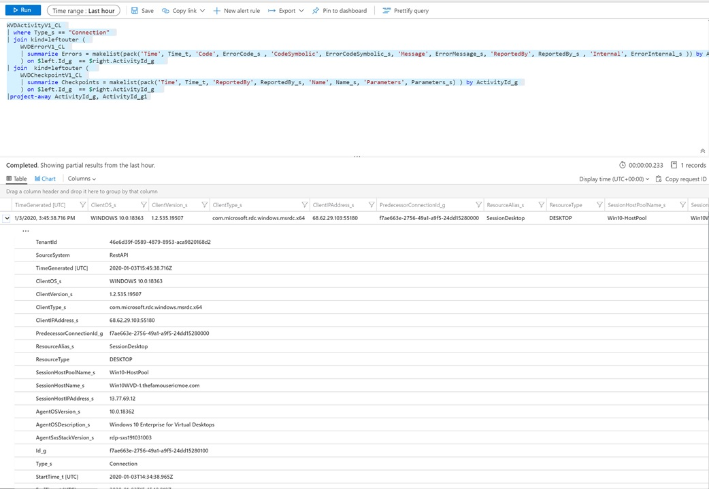


#### Task 6: Enable Azure Monitor and Insights

The Map feature in Azure Monitor collects data from the Microsoft Dependency Agent. The Dependency Agent relies on the Log Analytics agent to send data to Log Analytics.

This means we will need to use the Azure Dependency agent extension to install the agent. You can either install it in your "golden image" or through the Auzre portal. In this lab we will use the Azure portal.

First, in the Azure portal, navigate to one of the Virtual Machines in your host pool.

Under the Monitoring section of the blade, select Insights (preview). Optionally, in the Overview blade, there may also be a Monitoring Insights (preview) option that you can select.

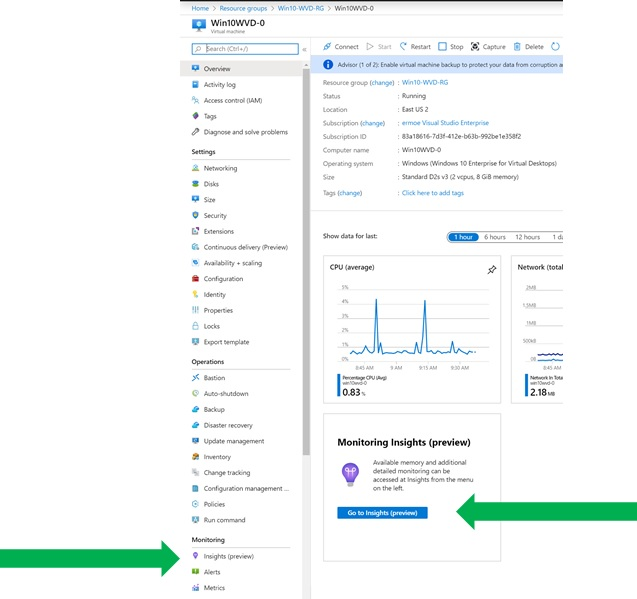

When you select to enable Insights (preview) you will have the option to select the Log Analytics workspace. Select the same workspace you have been using in this entire lab.

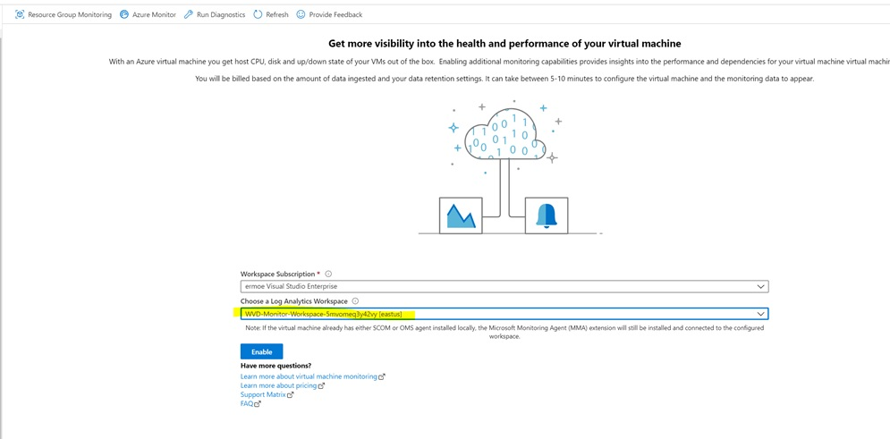

The deployment will take several minutes to complete.

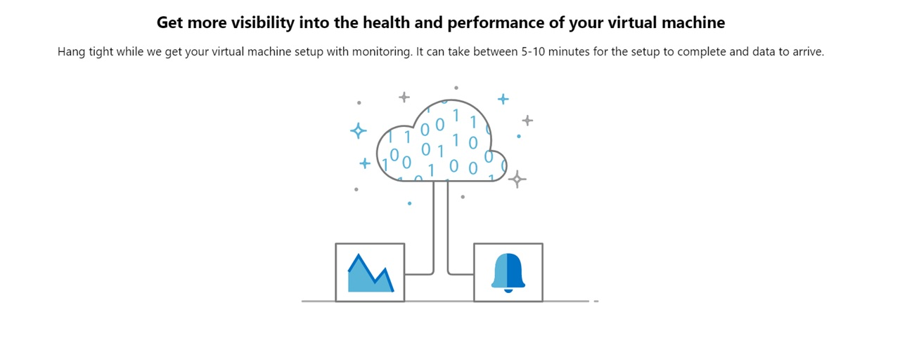

After the deployment is complete, wait a few more minutes for activity to be collected. Then, select Azure Monitor as shown below


Verify that the Monitor Coverage is set to Enabled for your virtual machines.


Select **Map** as shown in the image above.

Once Map launches you can see the mapping of ports across your different components within WVD.


You can expand different components to see more details as shown below:


Select different components to see the types of data captured (processes, ports, etc.)

Navigate back to your Log Analytics workspace. You will new logs under _Service Map_:

* InsightsMetrics
* VMBoundPort
* VMComputer
* VMConnection
* VMProcess

Under _Custom Logs_ you will see the following new logs:

* ServiceMapComputer_CL
* ServiceMapProcess_CL


