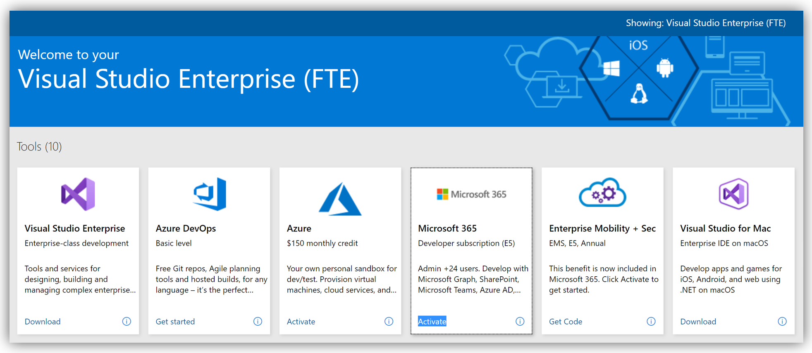
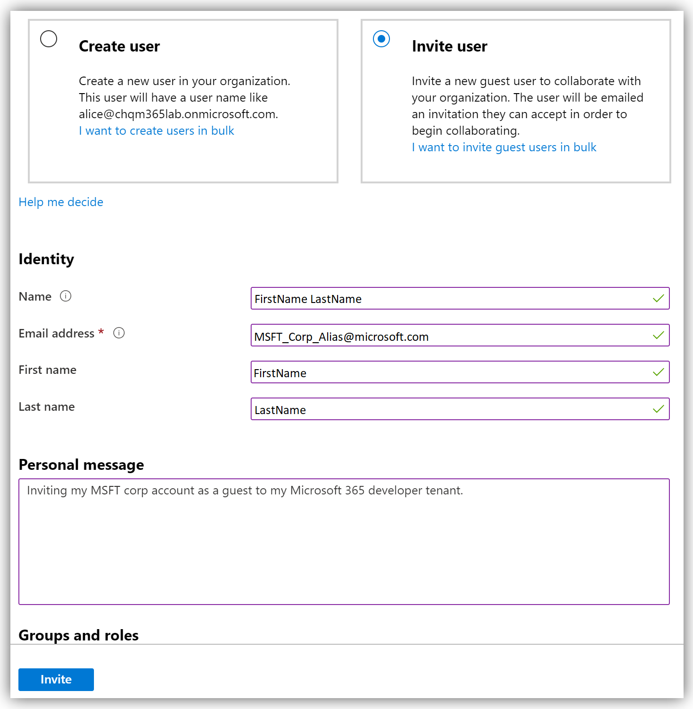

# Lab 1: Deploying an Azure AD Tenant

---
In this exercise you will be creating a new Azure Active Directory tenant leveraging your My Visual Studio benefits. More specifically you will be activating the [Microsoft 365 Developer subscription (E5)](https://docs.microsoft.com/en-us/visualstudio/subscriptions/vs-m365) benefit. This benefit will provide you with the necessary licensing to support a full Windows Virtual Desktop environment.

After completing this exercise you will have the following components:

- A new Azure Active Directory tenant.
- A user account in the tenant with the Global administrator role.
- A guest account in the tenant for your MSFT corp account.

---

## 1. Activate your Microsoft 365 Developer subscription

1. Navigate to the [My Visual Studio](https://my.visualstudio.com) benefits page. If prompted, sign in with your credentials.
2. Locate the **Microsoft 365** tile in the **Tools** category and click **Activate**.

   

3. Navigate through the registration process. During this process you will create a new Azure AD tenant and user account. _**Keep these credentials in safe place!**_ 
4. Once registration is complete you will arrive at the **Microsoft 365 Developer Program** page, as shown below. Confirm the subscription shows **Active**.
  
   

## 2. Invite your MSFT corp account

1. Navigate to the [Azure portal](https://portal.azure.com/) and sign in using the account you created above.
2. Type **Azure Active Directory** in the search field and select it from the list.
3. Review the **Overview** blade for Azure Active Directory. Make a note of the domain name and Tenant ID.
4. Under Manage, click **Users**.
5. On the Users blade, click **+ New guest user**.
6. On the New user blade, fill in the required fields and click **Invite**, as shown below.

   

7. On the Users | All users blade, confirm your MSFT corp account is listed as a Guest.
8. Monitor your MSFT corp mailbox for an email from Microsoft Invitations. Once received, click **Accept invitation**. Sign in with your MSFT corp email and accept the permissions update. Your MSFT corp account is now a guest in your Microsoft 365 developer tenant.

Return to [Main Page](prepare.md)
