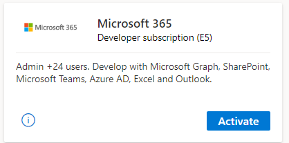
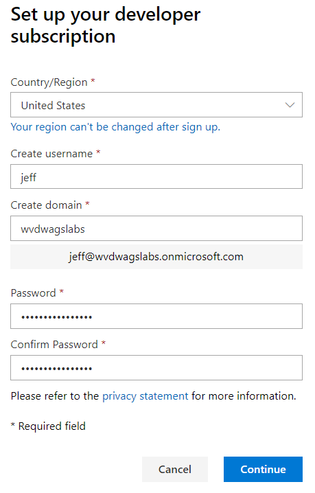
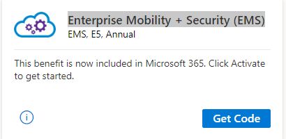

# Lab 1: Prerequisites

In the lab you will complete all the necessary prerequisites to build out a Windows Virtual Desktop environment.

>NOTE: If you already have an Office 365 subscription with an Enterprise Mobility + Security (EMS) E5 license environment, please complete only Exercise 1.

If you do not have an Office 365 subscription with an Enterprise Mobility + Security (EMS) E5 license environment, please complete all exercises.

## Azure subscription

Your will need an Azure subscription to complete the Windows Virtual Desktop labs.  The following are ideal subscription types to utilize:

* Visual Studio Enterprise subscription
* IUR (Azure Use Rights) from your partner organization

**Microsoft does not recommend using any Azure subscription that has production workloads or services.  Use a subscriptin that is designation for testing purposes only.**

If you are using IUR, contact the subscription administrator at your partner organization.  The can provision your identity into the subscription and assign the appropriate rights.

## Rights assignments

Your identity within your subscription must have the following rights assignments:

* **Global administrator** permissions within the Azure Active Directory tenant.
  * This also applies to Cloud Solution Provider (CSP) organizations that are creating a Windows Virtual Desktop tenant. If you're in a CSP organization, you must be able to sign in as global administrator.
  * The administrator account must be sourced from the Azure Active Directory tenant in which you're trying to create the Windows Virtual Desktop tenant. This process doesn't support Azure Active Directory B2B (guest) accounts.
  * The administrator account must be a work or school account
* Ensure that the user who will provision & configure WVD must have at least **Contributor** rights to the Azure subscription.
  * Based on the operating model, some customers might not have this enabled so contact your CSP-Partner who can help with the same.

## Exercise 1 - Install Windows Virtual Desktop PowerShell Module

Complete these steps to install the Windows Virtual Desktop PowerShell module:

1. To quickly download and install the Windows Virtual Desktop PowerShell module, launch PowerShell as an administrator and run the following command:

    `Install-Module -Name Microsoft.RDInfra.RDPowershell`

    *Type **Y** when prompted for installing from an untrusted repository.*

## Exercise 2 - Activate your Microsoft 365 subscription

This exercise assumes you have a Visual Studio Enterprise subscription.  

>DO NOT complete these steps if you have an Office 365 subscription with an Enterprise Mobility + Security (EMS) E5 license environment.  Return to the [Prepare Phase Labs](prepare.md) and continue subsequent labs.

1. Navigate to the [My Visual Studio](https://my.visualstudio.com) benefits page. If prompted, sign in with your credentials.
2. Locate the **Microsoft 365** tile in the **Tools** category and click **Activate**.
  
3. If prompted, sign in with your credentials.
4. Click on **SET UP SUBSCRIPTION**
5. Enter the following information and click **Continue**:
    * Create username: *yourfirstname*
    * Create domain: WVD*yourinitials*Lab (e.g. WVDXYZLab).  Hit **Tab**.
        *Ensure validation passes as your namespace needs to be unique within the onmicrosoft.com namespace.  We often see students choosing a domain name that already exists.*

        ***Write this domain name down as your Azure Active Directory Domain Name.***
    * Password: **Complex.Password**
    * Confirm Password: **Complex.Password**
  
6. Enter your cell phone number and click **Send Code**.
7. Enter your activation code and click **Set up**.
8. Click on **Go to subscription**.

## Exercise 3 - Activate your Enterprise Mobility + Security (EMS)

1. Return to the [My Visual Studio](https://my.visualstudio.com) benefits page.
2. Locate the **MEnterprise Mobility + Security (EMS)** tile in the **Tools** category and click **Get Code**.
  
3. When the coupon code has been successfully retrieved, click **"Activate"** to proceed.
4. If prompted, select **Yes, add it to my account**, otherwise choose **Try now**.
5. Note your confirmation number and click **Continue**.

Return to [Prepare Phase Labs](prepare.md)
