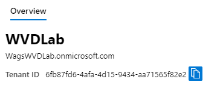
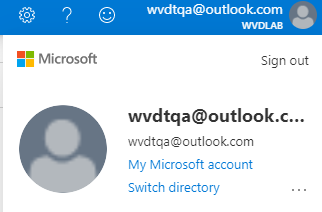
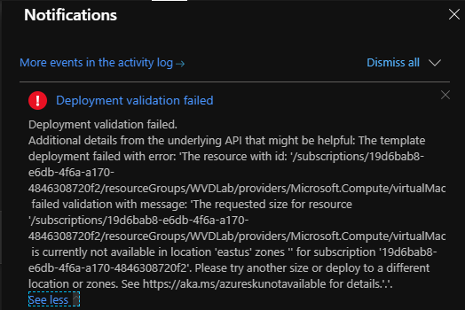

# Lab 3: Deploying Azure Infrastructure

In this exercise you will leverage a custom Azure Resource Manager (ARM) template to deploy the required Active Directory Domain Services infrastructure for Windows Virtual Desktop.

## Exercise 1 - Install Azure Active Directory

1. In the Azure Portal, click **Microsoft Azure** and then **+Create a resource**.  Select **Identity** and then **Azure Active Directory**.
2. Enter the following on the **Create directory** tab:
    * Organization name: **WVD Lab**
    * Initial domain name: `<yourinitials>`WVDLab
    * Hit **Tab**.

        >Ensure validation passes as your namespace needs to be unique within the onmicrosoft.com namespace.  We often see students choosing a domain name that already exists.

3. Click **Create**.  It will take several minutes for the directory to be created.
4. Once complete, click **here** to manage your new directory.

    >**Copy the Azure Active Directory Domain Name and Tenant ID to a scratch location such as Notepad.**

    

## Exercise 2 - Deploying the ARM template

1. Open a new tab in your browser and navigate to the [ARM template](https://github.com/PeterR-msft/M365WVDWS/tree/master/AAD-Hybrid-Lab).
2. Review the notes on the GitHub page for the ARM template prior to deployment.
3. Under Quick Start, click **Deploy to Azure**. If you receive an error about not having any subscriptions, click on your name in the upper right-hand corner, then click on **Switch Directory**, and select your **Default Directory**.

    

4. If prompted, make sure to sign in with an account that is an owner for the Azure subscription.
5. Complete the following fields:
   * Resource Group: *Create New* **WVDLab**
   * Location: Select an Azure region
      > Note:  Use this same region for every part of the lab!
   * Admin Password: `Complex.Password`
   * AD Domain Name: Enter a Fully Qualified Domain Name (e.g. MyWVDLabs.com)
      >Please write down what you enter!
   * CustomUPNSuffix: *Enter the last four digital of your cellphone*
   * Default User Password: `Complex.Password`
   * Vm Size: **Standard_B2ms**
6. Agree to the Terms and conditions and click **Purchase**.  

The deployment is now underway. On average this process can take 30 minutes to complete. It is important that you monitor the deployment progress to ensure there are no problems. You can monitor progress by clicking the **Notifications** bell in the upper right corner and clicking **Deployment in progress...**.

>One of the typical errors we see is the Standard_B2ms VM size isn't currently available within the region.



You need to determine what VM SKUs are available in your specific region based upon your Azure subscription.  Enter the following PowerShell command:

```PowerShell
# Connect to your Azure subscription
Connect-AzAccount

# See what SKUs are available
# Don't forget to change the command line to the region where you plan to deploy resources
Get-AzComputeResourceSku | where {$_.Locations.Contains("eastus") -and $_.ResourceType.Contains("virtualMachines") -and $_.Name.Contains("Standard_") }
```

### Edit the template

The template is pre-populated with a list of VM sizes to choose from.  Based upon several factors your VM size might not be availble from the list, so the list needs to be edited.

1. On the **Custom deployment** screen, click on **Edit template**.
2. Expand **Parameters** and select **vmSize (string)**
3. Find vmSize, which is around line 100, which looks like this:

```PowerShell
"vmSize": {
            "type": "string",
            "defaultValue": "Standard_A2_v2",
            "allowedValues": [
                "Standard_A2_v2",
                "Standard_A4_v2",
                "Standard_A2M_v2",
                "Standard_A4M_v2",
                "Standard_A4_v2",
                "Standard_D2_v2",
                "Standard_D3_v2",
                "Standard_D11_v2",
                "Standard_D12_v2",
                "Standard_B2ms",
                "Standard_B2s",
                "Standard_B4ms",
                "Standard_F2",
                "Standard_F2s_v2"
```

4. Append to the end of the array the following value `Standard_D2s_v3`.  Your text should now look like this:

```PowerShell
        "vmSize": {
            "type": "string",
            "defaultValue": "Standard_A2_v2",
            "allowedValues": [
                "Standard_A2_v2",
                "Standard_A4_v2",
                "Standard_A2M_v2",
                "Standard_A4M_v2",
                "Standard_A4_v2",
                "Standard_D2_v2",
                "Standard_D3_v2",
                "Standard_D11_v2",
                "Standard_D12_v2",
                "Standard_B2ms",
                "Standard_B2s",
                "Standard_B4ms",
                "Standard_F2",
                "Standard_F2s_v2",
				"Standard_D2s_v3"
            ],
```

5. Click **Save**, then **I agree**, and then click **Purchase**.

Once the ARM template is done being deployed, the status will change to complete. At this point the domain controller is ready for RDP connectivity.

### Return to [Prepare Phase Labs](prepare.md)
