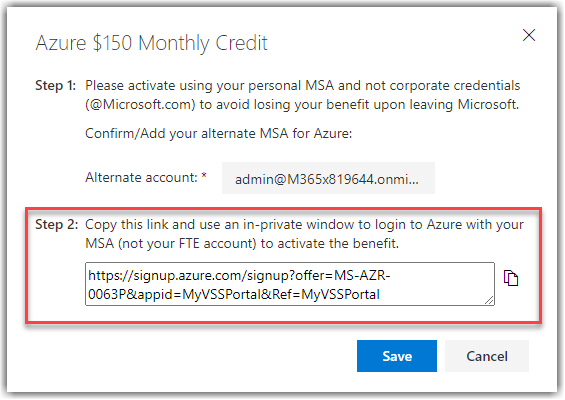
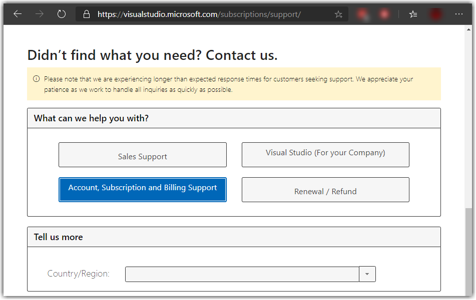
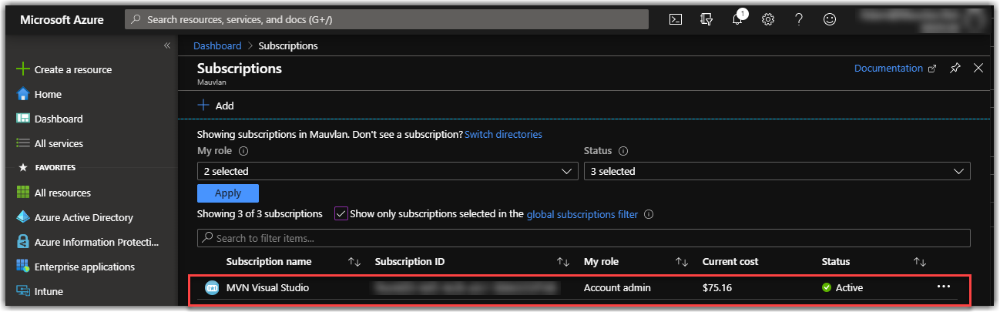
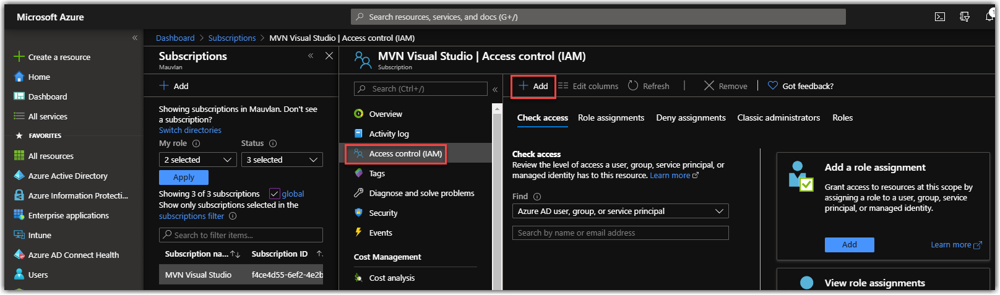
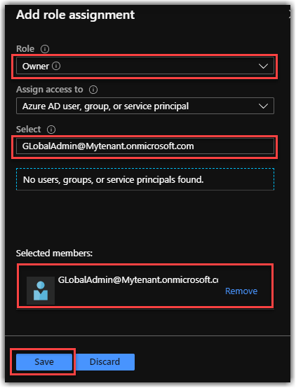

Exercise 2: Deploying an Azure Subscription 
--------------------------------------------------
---
In this exercise you will associate your My Visual Studio Azure subscription benefit with the M365 developer tenant that you activated in [Exercise 1](/Windows-Virtual-Desktop-on-Azure-Lab/Prerequisites/Exercise-1:-Azure-AD-Tenant) of the prerequisites. The Azure subscription benefit provides you with $150 in Azure credits every month. These credits will be used to host your WVD environment.

For advanced deployments, you have the option to use your Microsoft internal AIRS subscription, but for the initial provisioning of the WVD tenant plan on using your Visual Studio subscription. For more information on leveraging your AIRS subscription, refer to the Advanced Deployment section of this guide.

---

# Setup your Azure subscription
Now that you have an Azure AD tenant and a user account with the global admin role, you need to associate your Visual Studio Enterprise Azure subscription (VSE subscription) to the tenant. This enables 
you to create new resources in Azure and assign access.

**Task 1: Add an Azure subscription to your Azure AD Tenant**
1. Navigate to [My Visual Studio Subscriptions](https://my.visualstudio.com/Subscriptions).
2. Under **Alternate account**, add the global admin account from your M365 developer tenant, as shown below.

   

1. Navigate to the [My Visual Studio Benefits](https://my.visualstudio.com/Benefits) page. 
2. Locate the Azure tile in the Tools category and click **Activate**.

   

3. On the Azure $150 Monthly Credit window, **copy the URL** provided in Step 2.

    

4. Open an **InPrivate** browsing session, paste the URL and hit **enter**.

5. Sign in using the global admin account from your M365 developer tenant.

    

6.  Once you have authenticated, accept the prompt to associate the subscription.

    >   (Optional) If you receive an error stating that you have already activated this
    >   benefit then you may have already associated the benefit with another
    >   subscription. This can occur if the benefit is in use with another tenant or has
    >   been used in the past for a different demo.
    >
    >   If you are unsure where the benefit is activated, please submit a support 
    >   case with Visual Studio to have your benefit reset. [Link to
    >   Support](https://visualstudio.microsoft.com/subscriptions/support/).
    >
    >   If you know where your subscription is located and need instructions for moving 
    >   it to your new Azure AD tenant, jump down to the section: **_Moving a Subscription_**. 
    >   Note that this process will not work for AIRS internal billing subscriptions, as they 
    >   cannot currently be transferred to another tenant.

    

7. Navigate to  the [Azure Portal - Subscriptions blade](https://portal.azure.com/#blade/Microsoft_Azure_Billing/SubscriptionsBlade) and sign in using your global admin account. 

8. On the Subscriptions blade, verify that you can see the new VSE subscription. The name of this subscription can very, but for a brand new subscription you should see the Current cost reporting $0.

   

With your subscription in place, you are now ready to move on to exercise 3, focused on deploying your 
Active Directory Domain Controller and bridging your on-premise authentication with your Azure AD Tenant 
using Azure AD Connect.

**Optional Task: Moving a Subscription**

In order to move a subscription from one Azure AD tenant to another, you will need access to 
a global admin account in both environments. This includes the existing environment where 
the subscription is currently located and the new environment where the subscription
will be transferred to. Follow the steps below to complete a subscription
transfer.

1. Navigate to the [Azure Portal - Subscriptions blade](https://portal.azure.com/#blade/Microsoft_Azure_Billing/SubscriptionsBlade) and sign in with the global admin account for the source subscription.

2. Select the subscription you need to transfer and click **Access control
    (IAM)**.

3. On the Access control (IAM) blade, click **+ Add** and select **Add role assignment**.

   

4. For Role select **Owner**. For **Select** type the global admin account for the 
destination tenant. Select the account from the list and click **Save**.

   

5. Review the new notification in the upper right corner. Clicking the notification will 
reveal an **invitation link**, as shown below. Right-click on the link and copy it. Paste 
this link in an **InPrivate** browsing session.

   

6. Sign in using the global admin account for the destination tenant and accept the permissions 
request. This will bring you back to the Azure Portal.

7. On the Subscriptions blade, select your existing subscription and click **Change directory**.

   

8. Select the **destination directory** and click **Change**.

   

9. Accept the prompts and **WAIT**. This process will take about 15 – 20 min before the subscription 
will be available in the new tenant. Grab a snack and when it completes continue on to exercise 3.
