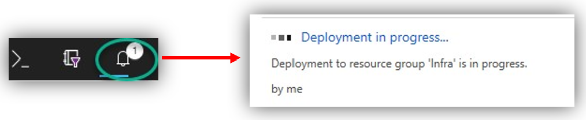

# Lab 3: Deploying Azure Infrastructure and AD DS

In this exercise you will leverage a custom Azure Resource Manager (ARM) template to deploy the required Active Directory Domain Services infrastructure for WVD.

Link to the ARM template: [AAD hybrid lab ARM template from GitHub](https://github.com/PeterR-msft/M365WVDWS/tree/master/AAD-Hybrid-Lab).

This ARM Template will provision the following resources:

* Virtual Network
  * Subnet
  * Network Security Group (NSG)
    * Permits AD traffic, permits RDP incoming traffic, restricts DMZ access.
  * DNS configured to point to the domain controller.
* Virtual Machine
  * Active Directory Domain Services is installed and configured.
  * Test users created in the domain.
  * Azure AD Connect is installed and ready for configuration.
  * Public IP address assigned for remote administration via RDP.

## Exercise 1 - Deploying the ARM template

1. Open a browser and navigate to the [ARM template](https://github.com/PeterR-msft/M365WVDWS/tree/master/AAD-Hybrid-Lab).

2. Review the notes on the GitHub page for the ARM template prior to deployment.
3. Under Quick Start, click **Deploy to Azure**. This will open a new browser tab to the Azure Portal for custom deployments.

   

4. If prompted, make sure to sign in with an account that is an owner for the Azure subscription.

   

5. Fill in the required ARM template parameters. Refer to the following example for more information on the parameters.

   

6. Agree to the Terms and conditions and click **Purchase**.  

   
                      
The deployment is now underway. On average this process can take 30 minutes to complete. It is important 
that you monitor the deployment progress to ensure there are no problems. You can monitor progress by 
clicking the **notification** bell in the upper right corner and clicking **Deployment in progress...**.

> *Note:* While automation can make things simpler and repeatable, sometimes it can fail. If at any time during the ARM template deployment there is a failure, review the failure, delete the Resource Group and try the ARM template again, adjusting for any possible errors.

Once the ARM template is done being deployed, the status will change to complete. At this point the domain controller is ready for RDP connectivity.

Return to [Prepare Phase Labs](prepare.md)
