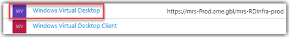

# Lab 5: Assign the “Tenant Creator” role to a user account

Assigning an Azure Active Directory user the Tenant Creator application role allows that user to create a Windows Virtual Desktop tenant associated with the Azure Active Directory instance. You'll need to use your global administrator account to assign the Tenant Creator role.

During this step you may notice the same account you used in the previous step listed as Default Access, this is not the same as Tenant Creator. So please be sure to complete the steps listed, and repeat if additional administrators will be provisioning Windows Virtual Desktop Tenants.

You can find more information here: [Assign the TenantCreator application role](https://docs.microsoft.com/en-us/azure/virtual-desktop/tenant-setup-azure-active-directory#assign-the-tenantcreator-application-role)

## Exercise 1 - Assigning Windows Virtual Desktop Tenant Creator Role

1. Return to the [Azure portal](https://portal.azure.com) and under you Azure Active Directory select **Enterprise applications**.

    >Make sure you select the right directory!

2. Browse for and select the **Windows Virtual Desktop** application.  You will need to hover over `Windows Virtual Desktop` in order to select it.

    

3. Under **Getting Started** select **Assign Users and groups**.
4. Select **+ Add user**, and then click on  **Users None Selected**. Scroll down and then select **WVD Administrator**, the account we created in an earlier lab and granted  Global Admin rights to.
5. Select the user and click **Select**, followed by **Assign**.

### Continue with Lab 6: [Create a Windows Virtual Desktop Tenant](Prepare-Lab06-Create-a-Windows-Virtual-Desktop-Tenant.md)

### Return to [Prepare Phase Labs](prepare.md)
