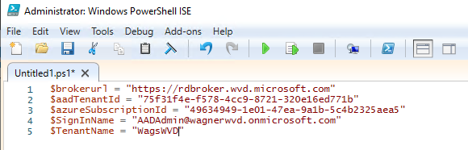
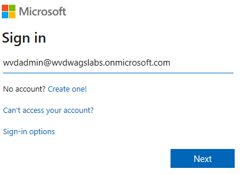
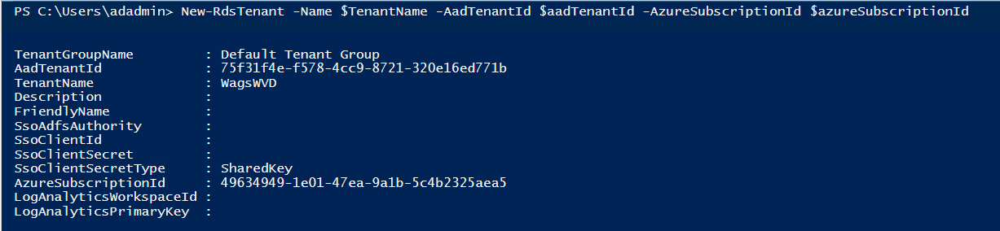
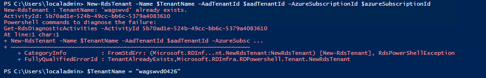
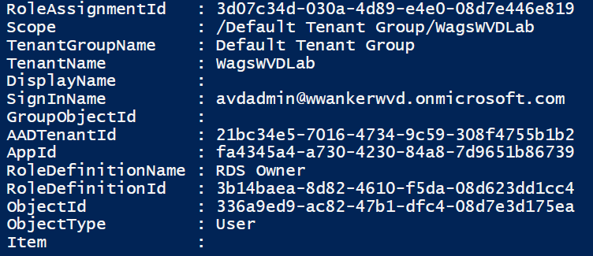

# Lab 6: Create a Windows Virtual Desktop Tenant

After assigning Tenant Creator role to your account you are now ready to provision your Windows Virtual Desktop Tenant. This is currently only achievable via PowerShell. Be sure to have the **Azure AD Tenant ID** and the **Subscription ID** collected earlier as you will use them to provision your tenant.

## Exercise 1 - Setting Deployment context

Capturing some of the commonly used strings into variables will make execution simpler as we execute various commands to provision our tenant. These variables will not change through out this entire deployment.  

1. From the desktop of the domain controller, open PowerShell ISE with Administrator credentials.  Enter and modify the following, then click run:

```PowerShell
$brokerurl = "https://rdbroker.wvd.microsoft.com"
$aadTenantId = "Your Azure AD Tenant ID"
$azureSubscriptionId = "Your Subscription ID"
$SignInName = "AzureADAdmin@<yourAzureADdomain>.onmicrosoft.com"
$TenantName = "The name of your tenant"
```

   > Note: Make sure your tenant name has no special characters!

   

2. Disable IE Enhanced Security Configuration for Administrators using steps previously provided.
3. Back in PowerShell ISE, paste the following command into the Output pane (the blue window) to install the required PowerShell modules:

   ```PowerShell
   Install-Module -Name Microsoft.RDInfra.RDPowershell
   ```

   > If prompted click **Yes** to installing the NuGet provider and **Yes to all** to installing from an untrusted repository.

## Exercise 2 - Sign into Windows Virtual Desktop Services

   The Add-RdsAccount command will log you into the Windows Virtual Desktop Platform Service, the account used here should be the same account you granted Tenant Creator in an earlier exercise . You only need to authenticate once per session, but if you close PowerShell and reopen you will need to run this command-let every time you decide to provision your Windows Virtual Desktop Tenant, so it’s wise to keep this on hand.

1. From the same PowerShell ISE with Administrator window enter the following into the Output pane:

   ```PowerShell
   Add-RdsAccount -DeploymentUrl $brokerurl
   ```

2. When prompted enter your WVDAdmin credentials (password is `Complex.Password`)

   > This was the account we granted Tenant Creator permission to.

     

## Exercise 3 - Provision your Windows Virtual Desktop Tenant

   The New-RDSTenant command-let will provision your new Tenant this will use your AAD Tenant ID and Subscription ID variables defined above. For the "Name" attribute in the command be sure to provide a unique name for your Windows Virtual Desktop tenant this will be used moving forward to identity the space in which you will deploy various host pools and resources.  

1. From the same PowerShell ISE with Administrator window enter the following into the Output pane:

```PowerShell
New-RdsTenant -Name $TenantName -AadTenantId $aadTenantId -AzureSubscriptionId $azureSubscriptionId
```



> If you get an error stating the tenant name already exists, simply change the value of `$TenantName` to a different value **WITH NO SPECIAL CHARACTERS** and re-run the PowerShell command.



## Exercise 4 - Add user roles to your Windows Virtual Desktop Tenant

Adding resources to your tenant is a critical step, and at this point we will define a **RDS Owner** role to deploy and maintain host pools moving forward. In many cases you would provision the same account as RDS Owner as you did for Tenant Creator to ensure those users can manage all aspects of the WVD Environment.

1. In the PowerShell ISE Output pane cut, paste, and enter the following:

```PowerShell
New-RdsRoleAssignment -SignInName $SignInName -RoleDefinitionName "RDS Owner" -TenantName $TenantName -AadTenantId $aadTenantId
```



>**Copy all this information to your scratch space!**

Congrats! You have now completed the steps to prepare your Windows Virtual Desktop enviorment.  

## Continue to Lab 7: [Deploy a Personal Host Pool](../Deploy/Deploy-Lab07-Deploy-a-Personal-Host-Pool.md)

## Back to [Technical Intensity Workshop - Windows Virtual Desktop Labs](../index.md)
