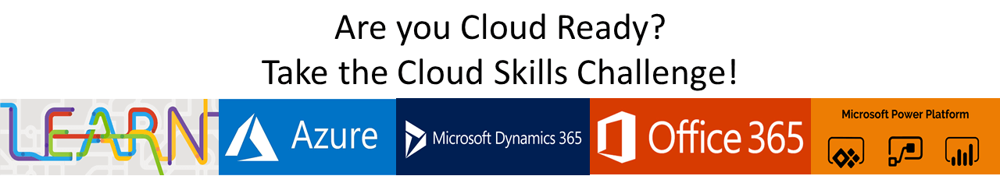

# US Partner Cloud Skills Challenge

Build your cloud skills with learning made easy and at your own pace! With hands-on self-paced learning covering your choice of lessons about Azure, Dynamics 365, Microsoft 365, and/or the Power Platform.

Microsoft Learn provides a free, interactive way of learning by combining short step-by-step tutorials, browser-based interactive coding and scripting environments, and task-based achievements to help you advance your technical skills while earning achievements. Our catalog of learning modules includes content covering the entire cloud platform and targeting all skill levels and roles (technical and non-technical).

The Cloud Skills Challenge helps you build your cloud skills with learning made easy! You can discover more about Azure, Dynamics 365, Microsoft 365, and/or the Power Platform with hands-on self-paced modules targeting all skill levels and roles (technical and non-technical). Microsoft Learn provides a free, interactive way to learn by combining short step-by-step tutorials, browser-based interactive coding and scripting environments, as well as task-based achievements to help you advance your technical skills while earning rewards. The Cloud Skills Challenge provides a fun way to  use Microsoft Learn to help you advance your cloud skills while earning prizes. 

As you complete each exercise you will earn points. The more points you earn the more chances you have to win one of three pairs of [noise cancelling Surface headphones](https://www.microsoft.com/en-us/p/surface-headphones/8NRM8DZ2ZW43) valued at $349.99.

## How do I participate

1. Use the links below to register for the challenges you want to participate in. 
1. You will get an email on the Challenge Start Date with instructions on how to log into the challenge. 
1. Complete challenge exercises **during the month at your pace** to earn points and move up the leaderboard. 

> NOTE: The system we are using for sign up requires us to specify a date and time for the event, however each of our challenges run the entire month. You have the entire month to complete as many exercises as you want and earn as much XP as you can. There will be NO physical or virtual meetings. 

## Challenge Schedule

| Event | Sign Up Link | Sign Up Deadline | Start Date | End Date | Winners Announced | Leaderboard |
| --- | --- | --- | --- | --- | --- | --- | 
| April 2020 Challenge | [Sign Up](https://msuspartners.eventbuilder.com/event/15261) | March 31 2020 | April 1 2020 | April 30 2020 | May 1 2020 | [Leaderboard](https://www.microsoft.com/en-us/cloudskillschallenge/Public/Contests/5f5faeea-c85a-4d6b-b35a-caaef84752e7) |
| May 2020 Challenge | [Sign Up](https://msuspartners.eventbuilder.com/event/15264) | April 30 2020 | May 1 2020 | May 31 2020 | June 1 2020 | [Leaderboard](https://www.microsoft.com/en-us/cloudskillschallenge/Public/Contests/d114aff0-4db6-46b4-b8ee-ae965b35bf9f) |
| June 2020 Challenge | [Sign Up](https://msuspartners.eventbuilder.com/event/15263) | May 31 2020 | June 1 2020 | June 30 2020 | July 1 2020 | [Leaderboard](https://www.microsoft.com/en-us/cloudskillschallenge/Public/Contests/8efad682-c87e-412d-9ff0-f5770241f282) |

## Official Rules

1. SPONSOR

   These Official Rules ("Rules") govern the operation of the US Partner Cloud Skills Challenge Sweepstakes ("Sweepstakes"). Microsoft Corporation, One Microsoft Way, Redmond, WA, 98052, USA, is the Sweepstakes sponsor ("Sponsor").

1. DEFINITIONS

   In these Rules, "Microsoft", "we", "our", and "us" refer to Sponsor and "you" and "yourself" refers to a Sweepstakes participant, which may be an individual person or an authorized representative entering on behalf of a business. By entering you (your parent/legal guardian if you are a minor) agree to be bound by these rules.

1. ENTRY PERIOD

   The Sweepstakes starts at 12:01 a.m. Pacific Time (PT) on the Challenge Start Date, and ends at 11:59 p.m. PT on the Challenge End Date ("Entry Period").

1. ELIGIBILITY

   This is a trade Sweepstakes open only to persons employed in the field of software research or software sales and development. You must legally reside in the 50 United States (including the District of Columbia), and be 18 years of age or older to be eligible. Minors who are 18 but who have not reached the age of majority in their State must have consent of a parent or legal guardian.

   Employees and directors of Microsoft Corporation and its subsidiaries, affiliates, advertising agencies, and Sweepstakes Parties are not eligible, nor are persons involved in the execution or administration of this promotion, or the family members of each above (parents, children, siblings, spouse/domestic partners, or individuals residing in the same household). Void where prohibited.

   If you are participating in your capacity as an employee, it is your sole responsibility to comply with your employer’s gift policies. Microsoft will not be party to any disputes or actions related to this matter. Microsoft is committed to complying with government gift and ethics rules and therefore **government and public sector employees are not eligible** to enter.

1. HOW TO ENTER

   No Purchase Necessary.

   You will receive one Sweepstakes entry for every 1000 xp learner points you accumulate in the challenge during the challenge period.

   We are not responsible for excess, lost, late, or incomplete entries. If disputed, entries will be deemed submitted by the authorized account holder of the email address, social media account, or other method used to enter.

1. WINNER SELECTION AND NOTIFICATION

   Pending confirmation of eligibility, potential prize winners will be selected by Microsoft or their Agent in a random drawing from among all eligible entries received by the Challenge End Date.

   Winners will be notified via the contact information provided during entry no more than 7 days following the drawing with prize claim instructions, including submission deadlines. If you are a potential winner and you are 18 or older, but are considered a minor in your place of legal residence, we may require your parent or legal guardian to sign all required forms on your behalf. If a selected winner cannot be contacted, is ineligible, fails to claim a prize or fails to return any Forms, the selected winner will forfeit their prize and an alternate winner will be selected as time allows through June 30, 2020. Up to three alternate winners will be selected, after which unclaimed prizes will remain unawarded.

1. PRIZES

   The following prizes will be awarded for each challenge:

   Three (3) Grand Prizes (s) for each challenge. Each winner will receive: 1 pair of Surface Headphones. Approximate Retail Value (ARV) $349.99.

   The ARV of electronic prizes is subject to price fluctuations in the consumer marketplace based on, among other things, any gap in time between the date the ARV is estimated for purposes of these Official Rules and the date the prize is awarded or redeemed. We will determine the value of the prize to be the fair market value at the time of prize award.

   We will only award one (1) Grand Prize per person during the Entry Period. No more than the stated number of prizes will be awarded. No substitution, transfer, or assignment of prize permitted, except that Microsoft reserves the right to substitute a prize of equal or greater value in the event the offered prize is unavailable. Prizes will be sent no later than 28 days after winner selection. Prize winners may be required to complete and return prize claim and / or tax forms ("Forms") within the deadline stated in the winner notification. Taxes on the prize, if any, are the sole responsibility of the winner, who is advised to seek independent counsel regarding the tax implications of accepting a prize. By accepting a prize, you agree that Microsoft may use your entry, name, image and hometown online and in print, or in any other media, in connection with this Sweepstakes without payment or compensation to you, except where prohibited by law.

2. ODDS

   The odds of winning are based on the number of eligible entries received.

3. GENERAL CONDITIONS AND RELEASE OF LIABILITY

   To the extent allowed by law, by entering you agree to release and hold harmless Microsoft and its respective parents, partners, subsidiaries, affiliates, employees and agents from any and all liability or any injury, loss or damage of any kind arising in connection with this Sweepstakes or any prize won.

   All local laws apply. The decisions of Microsoft are final and binding

   We reserve the right to cancel, change or suspend this Sweepstakes for any reason, including cheating, technology failure, catastrophe, war or any other unforeseen or unexpected event that affects the integrity of this Sweepstakes, whether human or mechanical. If the integrity of the Sweepstakes cannot be restored, we may select winners from among all eligible entries received before we had to cancel, change or suspend the Sweepstakes. Rules violators will be prosecuted to the full extent of the law and may be banned from participation in Microsoft Sweepstakes.

4. GOVERNING LAW

   This Sweepstakes will be governed by the laws of the State of Washington, and you consent to the exclusive jurisdiction and venue of the courts of the State of Washington for any disputes arising out of this Sweepstakes.

5. USE OF YOUR ENTRY

   Personal data you provide while entering this Sweepstakes will be used by Microsoft and/or its agents and prize fulfillers acting on Microsoft’s behalf only for the administration and operation of this Sweepstakes and in accordance with the Microsoft Privacy Statement.

6. WINNERS LIST

   Send email to usocpcsc@microsoft.com with the subject line "Cloud Skills Challenge winners" within 30 days of the Challenge End Date to receive a list of winners that received a prize worth $30.00 or more.