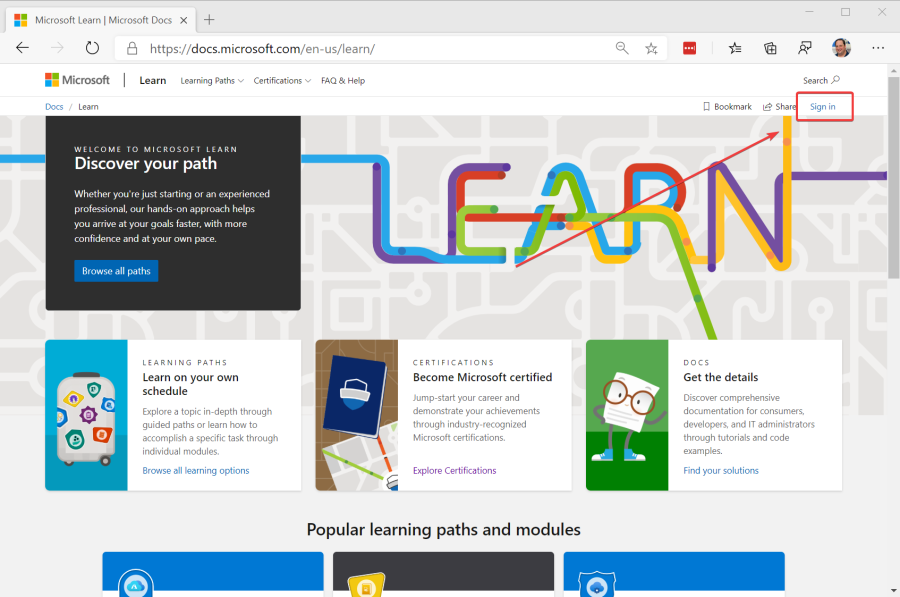
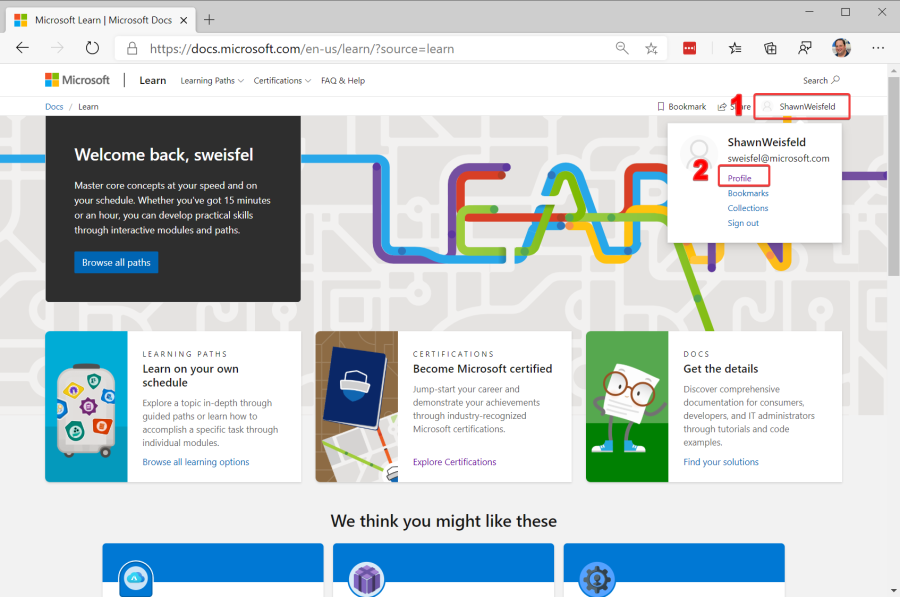
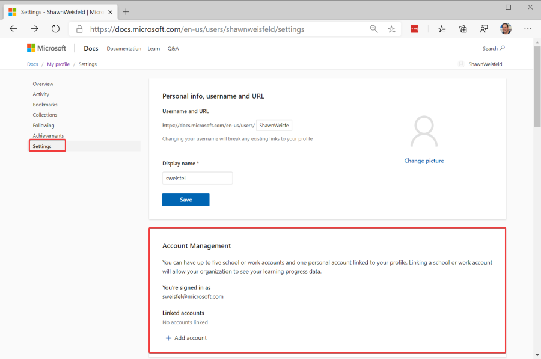
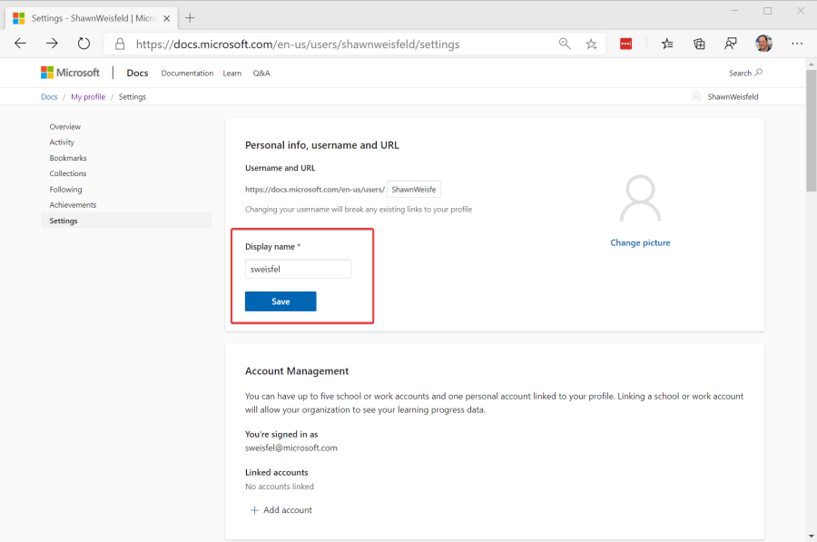
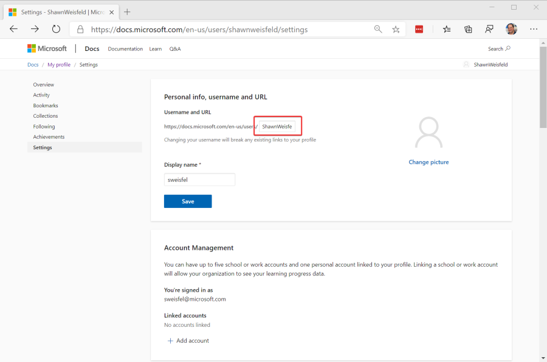
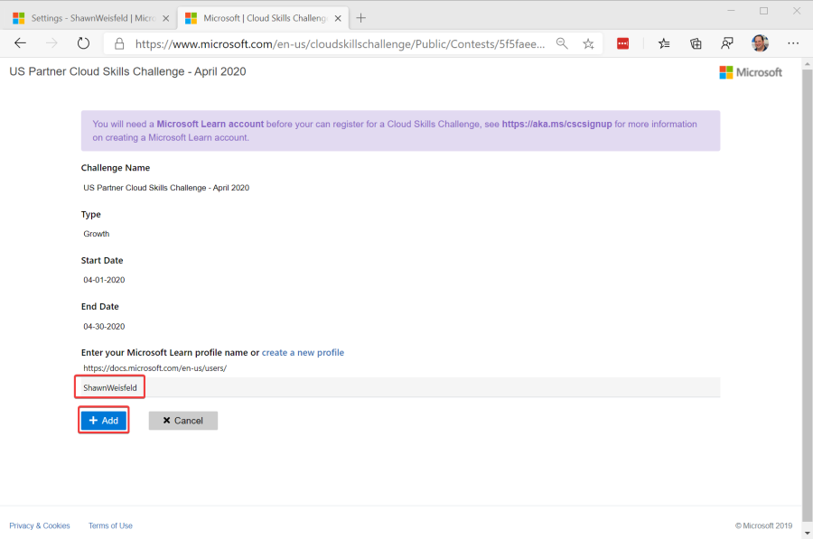
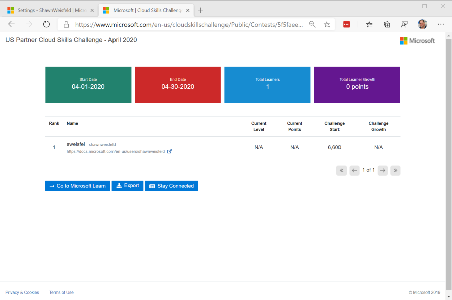

# Setup Instructions for April 2020 US Partner Cloud Skills Challenge

View full Challenge Details [here](http://aka.ms/usocpcsc).

If you have any issues/questions, please email us [usocpcsc@microsoft.com](mailto:usocpcsc@microsoft.com)

1. Sign up for a FREE MS Learn account [here](https://docs.microsoft.com/en-us/learn/). If you already have one, log into it. 

    

1. Open your MS Learn Profile, click your name in the upper right, and then select profile

    

1. Check your profile settings.

    1. Under Account Management be sure to link your MS Learn account to your work email address. Here you can see that I am signed in with my work account so I don't need to link. 
   
        

    1. Update your "Display Name" to be whatever you want. This will be visible on the Challenge Leaderboard. 

        

    1. Copy your username, you will need it for the next step. 

        

1. Enter your MS Learn username on the **challenge onboarding** page and then press the add button. 
    1. [Challenge Onboarding for May's Challenge](https://www.microsoft.com/en-us/cloudskillschallenge/Public/Contests/d114aff0-4db6-46b4-b8ee-ae965b35bf9f/register)
    1. [Challenge Onboarding for June's Challenge](https://www.microsoft.com/en-us/cloudskillschallenge/Public/Contests/8efad682-c87e-412d-9ff0-f5770241f282/register)

    

1. You will be redirected to the Challenge Leaderboard.

    

1. Now you can go back to [MS Learn](https://docs.microsoft.com/en-us/learn) and start working on any of the exercises. 

  > You can come back to [MS Learn](https://docs.microsoft.com/en-us/learn) at any time before the end of the month. Just make sure you are logged into the correct account when completing the exercises. 

  > **The more exercises you complete, the more points you will earn, the more entries you will get into the competition to win a great prize.** 

  > Points on the leaderboard get updated nightly. 